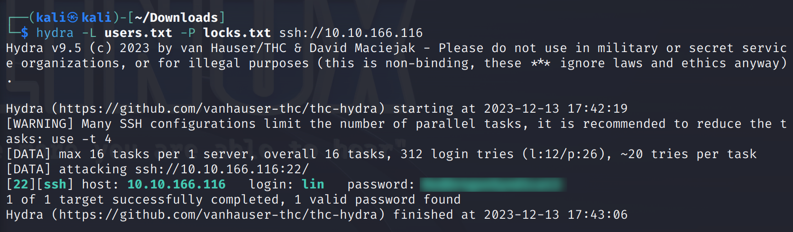
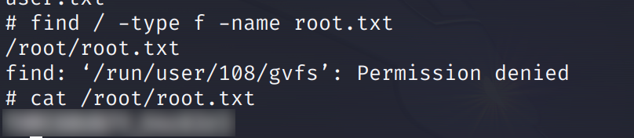

> En esta room vamos a proceder a obtener las flags *user.txt* y *root.txt* mediante varias técnicas que vamos a ver a continuación.

# User.txt
Mediante `nmap` vamos a realizar un escaneo de los puertos de la maquina objetivo:

```bash 
nmap -sC -sV -p- <ip_maquina_objetivo>
```

<div style="text-align: center; ">
    
</div>

Hemos encontrado varios puertos abiertos → 21 (servicio FTP), 22 (servicio ssh) y 80 (página web).

Vamos a ver que hay en el puerto 80, es decir la página web:
<div style="text-align: center; ">
    
</div>

Como vemos no encontramos gran cosa, pero podemos intentar buscar directorios ocultos en esta web mediante ***gobuster***.

<div style="text-align: center; ">
    
</div>

No encontramos nada imporante, solamente un directorio "/images" que no contiene nada relevante.

Si recordamos tenemos abierto el puerto 21 (FTP), este es un servidor que donde podemos cargar y descargar archivos. Podemos ver que este servicio ofrece una conexión anónima, por lo que vamos a aprovecharnos de eso:
 
<div style="text-align: center; ">
    
</div>

Si listamos los ficheros que hay en el servidor encontramos un par de ellos que mediante el comando `get <nombre_fichero>` podemos descargarlos en nuestra máquina:
<div style="text-align: center; ">
    
</div>

El archivo ***locks.txt*** contiene muchas contraseñas y el archivo ***tasks.txt*** contiene un texto y el nombre de quien lo ha escrito.

Como tenemos el nombre y una serie de contraseñas vamos a realizar una conexión vía ssh para poder entrar en el sistema:

- Primero creamos un archivo ‘users.txt’ que contenga todos los nombres que hemos obtenidos en la la pagina web anterior.
- Realizamos un ataque de fuerza bruta con `hydra`para poder encontrar un usuario y contraseña compatibles.

<div style="text-align: center; ">
    
</div>

Ahora procedemos a realizar la conexión `ssh` .

<div style="text-align: center; ">
    
</div>

Ahora vamos a tirar el comando `find`para poder buscar el archivo ***User.txt*** que es nuestra flag a buscar → `find / -type f -name 'user.txt'` . 

Donde ***-type*** (tipo de archivo), ***-name*** (nombre del archivo).

<div style="text-align: center; ">
    
</div>

---

# Root.txt

Ahora para poder obtener el archivo ***Root.txt*** debemos de escalar privilegios ya que si realizamos la búsqueda anterior de ***find*** nos dirá que no tenemos acceso al directorio /root.

Para ello, vamos a buscar una manera de poder adquirir permisos root.

<div style="text-align: center; ">
    
</div>

Vemos que lin puede ejecutar comandos tar, por tanto, vamos a buscar un exploit.

Buscamos el exploit en gtfobins → [GTFOBins](https://gtfobins.github.io/) , buscamos tar y vamos al apartado **Sudo**.

<div style="text-align: center; ">
    
</div>

Si tiramos ese comando en el bash de la maquina a atacar tendremos acceso root y podemos realizar la búsqueda del archivo.

<div style="text-align: center; ">
    
</div>

Hemos encontrado la flag de root.txt.