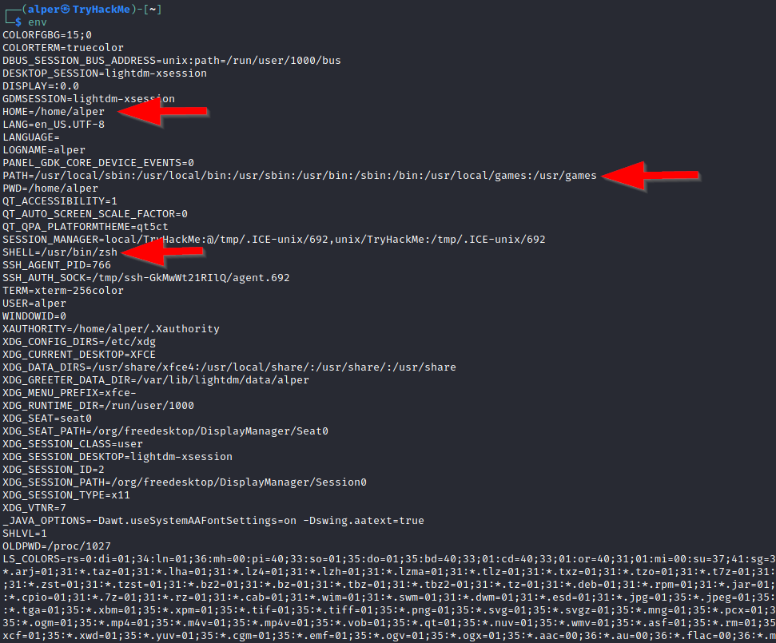

# Escalar Privilegios en Linux


Escalar privilegios consiste en explotar una vulnerabilidad del sistema para ganar acceso no autorizado desde una cuenta con pocos permisos (privilegios) a una con mayor número de los mismos, siendo el *root* aquella cuenta la cual tiene todos los permisos en el sistema.

Mediante estos procesos podemos realizar varias tareas como:

- Resetear contraseñas.
- Saltar el control del acceso a datos protegidos.
- Habilitar la persistencia.
- Modificar la configuración del sistema.
- Cambiar los privilegios de los usuarios.

# Enumeración

La enumeración es el primer paso para poder ganar acceso a cualquier sistema. Como hemos comentado antes, mediante la explotación de una vulnerabilidad critica del sistema podemos acceder a una cuenta con altos privilegios o incluso a una cuenta  de superusaurio (root). Para ello debemos de conocer algunos métodos de enumeración:

## Hostname

El comando `hostname`  nos devuelve el nombre de la máquina objetivo que en ocasiones nos puede devolver información útil para conocer el rol de la maquina en la red.

## Uname -a

Con el comando `uname -a` vamos a poder imprimir por pantalla información adicional sobre el kernel que está usando el sistema. Esto es muy útil para poder buscar *vulnerabilidades a nivel kernel*, para poder escalar privilegios.

## /proc/version

Si miramos en el directorio `/proc/version` podremos ver la versión del kernel y datos adicionales, además el sistema de archivos proc (*procfs*) nos ofrece información sobre los procesos del sistema destino.

## /etc/issue

El sistema también puede ser identificado si consultamos el archivo `/etc/issue`, el cual contiene información sobre el S.O pero esto se puede personalizar o cambiar fácilmente.

## Comando ps y pspy

El comando `ps`  nos muestra todos los procesos en ejecución en el sistema Linux, donde se muestra lo siguiente:

- PID: ID del proceso.
- TTY: Tipo de terminal utilizado.
- Time: Cantidad de tiempo de uso de CPU.
- CMD: Comando o ejecutable que está corriendo.

Este comando nos ofrece varias opciones como es el caso de `ps -A` donde vemos todos los procesos ó `ps aux` donde muestra los procesos de todos los usuarios (a), el comando que lanza el proceso (u), y muestra procesos que no están ligados a la terminal (x).

Viendo la salida del comando ps, podemos entender de mejor manera el sistema y las posibles vulnerabilidades que pueden haber en él.

Sin embargo, el comando `ps` puede que no nos muestre algunos procesos deseados, por tanto, para ello haremos uso de `pspy` 

## Comando env

El comando `env` nos muestra las *environmental variables* (variables de entorno):

<div style="text-align: center; ">
    
  </div>


La variable `*PATH*` es la ruta que utiliza el shell para realizar la ejecución de comandos y ejecutables (sin tener que especificar la ruta), si la alteramos a nuestro favor, podremos acceder a ficheros sin tener los privilegios necesarios para hacerlo de forma normal.

## Comando sudo-l

Con el comando `sudo -l` podemos listar los comando que puede hacer uso el usuario para convertirse en usuario root, es decir, lista de comandos que el usuario puede ejecutar usando *sudo.*

Esto no implica que siempre se ejecuten como root, si no que pueden dar permisos para ejecutar archivos como `www-data`.

## Comando ls

Este comando `ls` nos permite listar los archivos y directorio, es uno de los más comunes, pero a la hora de escalar privilegios es muy útil ya que nos puede ayudar a buscar archivos o directorios que están ocultos, esto lo podemos hacer mediante el comando `ls -la`.

En este ejemplo vemos como haciendo uso de `ls` no nos muestra nada pero si hacemos uso de `ls -la` encontramos un archivo llamado *secret.txt*.

<div style="text-align: center; ">
    
  </div>


## Comando Id

Con el este comando, podemos obtener información sobre el nivel de privilegios de un grupo de usuarios o del usuario.

## /etc/passwd

En el archivo del directorio `/etc/passwd` vamos a encontrar todos los usuarios del sistema.

Si hacemos un `cat /etc/passwd` obtendremos como salida:

<div style="text-align: center; ">
    
  </div>


Podemos hacerlo más legible y usarlo como una lista para un ataque de fuerza bruta haciendo `cat /etc/passwd | cut -d ":" -f 1` , donde cortamos desde los “:” y solamente nos quedamos con la primera columna:

<div style="text-align: center; ">
    
  </div>

## Comando history

Si escribimos `history` en la terminal esta nos devolverá los inputs que se le han hecho anteriormente a la terminal, donde podremos encontrar información privilegiada.

## Comando ifconfig

Puede ser que nuestra máquina objetivo esté pivotando a otra red, por lo que con el uso del comando `ifconfig` podremos ver información sobre las interfaces red de la máquina. 

## Comando netstat

Con `netstat` podremos comprobar las interfaces de red y rutas existentes de una máquina, mediante `netstat -a` podremos ver todos los puertos de escucha abiertos y conexiones establecidas, con `netstat -at` (conexiones TCP), `netstat -au` (conexiones UDP) y con `nestat -l` listamos los puertos que están en modo escucha.

Con `nestat -s` listamos las estadísticas del uso de la red para cada protocolo, podemos especificar el protocolo con `-t` (TCP) ó `-u` (UDP).

## Comando find

Este comando es muy útil para poder buscar binarios con el bit SUID activado que pueden ser ejecutados por el usuario para escalar privilegios. Podemos hacer uso de “`2> /dev/null`” para que los errores los redireccionen a */dev/null*  y solo nos muestre los resultados sin errores.

Para realizar una búsqueda sería de la forma → `find / -type f -name <nombre_archivo> 2>/dev/null`, con la opción ’`f`’ estamos buscando ficheros, con un nombre determinado desde la raíz ‘`/`’

Como hemos comentado podemos hacer uso de find para la búsqueda de binarios con el bit SUID activado, para escalar privilegios, para ello, haríamos uso de `find / -perm -4000 2>/dev/null` ó `find / -perm -4000 -type f -exec ls -ld {} \; 2>/dev/null`,donde para cada archivo (fichero) `f` que busque tirará el comando `ls -ld` donde `{}` se reemplaza por el nombre de cada archivo y `\;` indica el fin del comando `-exec`.

Esta segunda es una búsqueda más completa debido a que nos puede ayudar a la hora de buscar el binario para ejecutar la vulnerabilidad.

<div style="text-align: center; ">
    
  </div>


# Escalar Privilegios: Exploits del kernel de Linux

El kernel en Linux gestiona las comunicaciones entre los diferentes componentes como la memoria del sistema y las aplicaciones.

Cualquiera de estas funciones tiene que tener los suficientes permisos para que se puedan llevar a cabo, por tanto, explotar una vulnerabilidad de este tipo nos otorgará permisos de root.

La metodología a seguir es:

1. Identificar la versión del kernel.
2. Buscar y encontrar un exploit para dicha versión del kernel.
3. Ejecutar el exploit.

Aunque esto parece muy simple, si el kernel falla se producirá un crash en el sistema.

### Ejemplo práctico:

Para identificar el kernel del sistema linux vamos a hacer uso del comando → `uname -a` 

<div style="text-align: center; ">
    
  </div>

Después del nombre *wade7363* encontramos la versión del kernel del sistema, si buscamos en Google algún CVE sobre dicha versión del kernel encontramos → [Exploit-DB](https://www.exploit-db.com/exploits/37292)

Aquí encontramos un script que nos permite explotar el kernel del sistema, para ello:

Primero de todo nos situamos en el directorio /tmp de **nuesta máquina** → `cd /tmp`  y creamos un fichero cuya extensión sea .c → `touch exploit.c`

A continuación copiamos el código del exploit y lo pegamos en nuestro fichero creado con `touch` 

Mediante el comando `python3 -m http.server 8080` creamos un servidor y en la máquina víctima hacemos uso del comando `wget` :

<div style="text-align: center; ">
    
  </div>


Se realiza la conexión y se descarga el archivo en la máquina víctima

Nos cambiamos al directorio /tmp en la máquina víctima y hacemos `wget` 

<div style="text-align: center; ">
    
  </div>


Ahora compilamos el script con `gcc nombre_arcivho.c -o nombre_archivo` para poder ejecutarlo de la forma `./nombre_archivo` 

En nuestro caso será:

Procedemos a compilar el archivo:

<div style="text-align: center; ">
    
  </div>


Vemos como ahora tenemos un ejecutable y el archivo con extensión .c

<div style="text-align: center; ">
    
  </div>

Ahora lo ejecutamos mediante `./exploit`

<div style="text-align: center; ">
    
  </div>


Vemos que ya hemos escalado privilegios a root, y ahora podemos hacer lo que queramos en el sistema.

# Escalar Privilegios: Sudo

Por defecto, el comando `sudo` nos permite la ejecución de programas y comandos a nivel de root. 

Como hemos visto anteriormente, mediante el uso del comando `sudo -l` podemos listar todos los comandos que puede ejecutar el usuario con privilegios de root.

Para poder aprovecharnos de esto, buscamos en [GTFOBins](https://gtfobins.github.io/) exploit del comando que nos dice que tenemos permisos de ejecutar.

En la vida real no todo se encuentra en GTObins o ExploitDB, por tanto, lo que podemos hacer es encontrar otras maneras como:

1. Verificar las configuraciones de Sudo → A veces la configuración de sudo en `/etc/sudoers` es incorrecta permitiendo a usuarios no autorizados poder ejecutar comando como root sin contraseña
2. Explotar vulnerabilidades de Software → Puede darse el caso de que el sistema tiene software vulnerable instalado que puede ser explotado para escalar privilegios.

### Ejemplo práctico:

Tenemos una máquina víctima, mediante `sudo -l` podemos ver los comando que puede ejecutar el usuario, en este caso el usuario *karen*, como root.

<div style="text-align: center; ">
    
  </div>


Vemos que puede hacer uso de varios comandos como root. Podemos usar cualquiera de los 3, asi que vamos a elegir el `/usr/bin/find`. Ahora nos vamos a [GTFOBins - SUDO](https://gtfobins.github.io/gtfobins/find/#sudo) para consultar información sobre como escalar privilegios y los ponemos en práctica:

<div style="text-align: center; ">
    
  </div>


Finalmente, hemos escalado privilegios a root.

# Escalar Privilegios: SUID

Como hemos visto arriba, mediante el comando `find / -perm -4000 -type f -exec ls -ld{} \; 2>/dev/null` podemos conocer los archivos que tienen activado el bit SUID para poder escalar privilegios.

Dependiendo del binario, podemos o bien convertirnos en usuarios con permisos root ó ejecutar comando que requieren de permisos root pero sin que el usuario actual los tenga (podemos verlo en el ejemplo práctico).

Tras haber realizado la búsqueda podemos buscar en [GTFOBins](https://gtfobins.github.io/) exploits dependiendo del binario a explotar, por ejemplo en el *ejemplo práctico* vemos que tenemos un binario `/usr/bin/base64`, por tanto buscaremos en dicha web el exploit SUID de base64.

### Ejemplo práctico:

Por ejemplo, si encontramos el binario base64 con bit SUID activado podemos hacer uso de su exploit para acceder a fichero los cuales hace falta ser root como `/etc/passwd` (usuarios del sistema) ó `/etc/shadow` (contraseñas del sistema).
<div style="text-align: center; ">
    
  </div>


Buscamos en https://gtfobins.github.io/ el exploit de bit SUID de base64 y vemos que si ejecutamos `LFILE =file_to_read` y luego `./base64 "$LFILE" | base64 --decode` podemos abrir ambos ficheros (especificándolos en *file_to_read*) sin tener permisos de root.

<div style="text-align: center; ">
    
  </div>


Contenido de `/etc/shadow`

<div style="text-align: center; ">
    
  </div>


Contenido de `/etc/passwd`

Mediante esto, en nuestra máquina podemos crear dos ficheros nuevos llamados, por ejemplo **users.txt** (contenido de `/etc/passwd`) y **passwords.txt** (contenido de `/etc/shadow`) y mandarlos a un nuevo fichero para desencriptar las contraseñas:

<div style="text-align: center; ">
    
  </div>


Y ahora vamos a desencriptarlas mediante el uso de **JohnTheRipper** haciendo uso de un diccionario de contraseñas (*rockyou.txt*):

<div style="text-align: center; ">
    
  </div>

Y como resultado tenemos la contraseñas:

<div style="text-align: center; ">
    
  </div>


# Escalar Privilegios: Capabilities

Otro método que los administradores de sistemas pueden usar para escalar el privilegio de un proceso o binario es las “Capabilities”, estas nos ayudan a gestionar permisos concretos a las aplicaciones para que se ejecuten sin tener que darles todos los permisos.

Comando `getcap -r / 2>/dev/null`.

Si nos encontramos algún lenguaje de programación podemos investigar para poder escalar privilegios, por tanto, si esto ocurre, vamos de nuevo a [GTFOBins](https://gtfobins.github.io/) para buscar exploits en el apartado C*apabilities.*

Si hacemos uso del comando anterior vamos a listar las *Capabilities* del sistema y por ejemplo nos encontramos:

<div style="text-align: center; ">
    
  </div>


Encontramos que 6 binarios tienen activas las *Capabilities*, los más interesantes son `/home/karen/vim` y `/home/ubuntu/view`.

Como nuestra flag se encuentra en `/home/ubuntu` y no podemos acceder ya que la flag tiene permisos root, tendremos que buscar una manera de poder acceder al fichero.

<div style="text-align: center; ">
    
  </div>


 En https://gtfobins.github.io/gtfobins/view/#capabilities podemos buscar información sobre el binario a explotar para poder acceder a la flag, pero si hacemos uso del comando `/home/ubuntu/view /home/ubuntu/flag4.txt` tenemos acceso a la flag explotando el binario `/home/ubuntu/view` sin tener que convertirnos en root.

Podemos hacer uso de cualquiera de los dos binarios con las *Capabilities* activadas para poder acceder al fichero de la flag.

<div style="text-align: center; ">
    
  </div>

Ejemplo con el binario view

<div style="text-align: center; ">
    
  </div>

Ejemplo con el binario vim

# Escalar Privilegios: Tareas Cron

Los *Cron Jobs* se utilizan para ejecutar binarios o scripts en un momento específico. Por defecto, pueden ejecutarlos con los permisos de sus propietario y no con los del usuario actual.

Gracias a esto, si encontramos una tarea con privilegios root, podemos cambiar el script que ejecuta dicha tarea para que la nuestra se ejecute con privilegios root.

Si hacemos un `cat /etc/crontab` podemos ver las tareas cron programadas del sistema, pero pueden haber tareas que mediante `cron` no pueden ser leídas, para eso podemos hacer uso de `pspy` .

Esta escalada de privilegio se realizan mediante una **reverse_shell**, por tanto, el fichero a modificar será un **.sh** donde sobrescribiremos el contenido del mismo por el código de la reverse_shell.

### Ejemplo práctico:

Tenemos una máquina víctima. Como hemos visto arriba mediante el comando `cat /etc/crontab` podemos ver los comandos y ejecutables que están programados.

<div style="text-align: center; ">
    
  </div>


Si nos fijamos bien, encontramos un fichero llamado **/home/karen/backup.sh** este tiene permisos root. Para poder escalar privilegios mediante esta manera tenemos que modificar dicho archivo y convertirlo en una reverse_shell.

En [RevShells](https://www.revshells.com/) podemos generar la reverse_shell que vamos a utilizar, para ello necesitamos conocer la ip pública de nuestra máquina → `ifconfig` → **tun0** y esta debe de ser de tipo **Bash**.

Incluimos en el fichero [**backup.sh**](http://backup.sh) la reverse_shell con `nano` .

<div style="text-align: center; ">
    
  </div>


Ahora le damos permisos de ejecución:

<div style="text-align: center; ">
    
  </div>


Vemos que se ha producido la reverse_shell y estamos dentro como root:

<div style="text-align: center; ">
    
  </div>


# Escalar Privilegios: PATH Hijacking

Los comandos en Linux se ejecutan desde la izquierda a la derecha, por tanto, si colamos un archivo malicioso en dicha ruta se ejecutará sin problema.

 Si hacemos un `echo $PATH` vamos a obtener la ruta que sigue el sistema para buscar los ejecutables y scripts, es decir busca dichos ejecutables sin tener que especificar toda la ruta.

Para ellos hacemos:

1. Creamos un fichero con la extensión .c, es decir un fichero con código en c → `touch archivo.c`
2. Ahora introducimos el código malicioso poniendo tanto el `suid` como `sgid` a 0:
    
    ```c
    #include <stdio.h>
    #include <stdlib.h>
    
    int main() {
        setuid(0); // Establece el ID de usuario a 0 (root)
        setgid(0); // Establece el ID de grupo a 0 (root)
        system("/bin/bash"); // Ejecuta una shell
        return 0;
    }
    ```
    
3. Mediante `gcc` vamos a compilarlo para que se convierta en ejecutable dicho binario → `gcc archivo.c -o archivo`
4. Ahora mediante `chmod +s archivo` vamos a dar asignarle permiso SUID, esto hará que se ejecute como root.
5. Ahora exportamos el directorio donde se encuentra dicho binario al PATH → `export PATH=<ruta_del_binario>:$PATH`
6. A continuación incluimos “/bin/bash” dentro del binario del PATH → `echo "/bin/bash" > archivo` (si previamente lo hemos hecho podemos saltárnoslo) y le damos todos los permisos `chmod 777 archivo`.
7. Finalmente, mediante `./archivo` ejecutamos el binario y escalamos privilegios.

Por tanto, no nos hace falta realizar una búsqueda de binarios con bit SUID, podemos crear un archivo malicioso nosotros, activando el bit SUID y mediante un código malicioso (lanzar una Shell, por ejemplo) escalar privilegios ejecutando otro comando diferente ya que este estará contenido en el la variable de entorno PATH.

### Ejemplo práctico:

Vamos a proceder a realizar un PATH Hijacking, para ello, primero vamos a echarle un ojo al PATH

<div style="text-align: center; ">
    
  </div>


En esta ruta podemos colar un binario que tenga el bit SUID activado para poder escalar privilegios → `find / -perm -4000 -ls 2>/dev/null`

Encontramos estos ficheros, pero el que nos interesa es el último de todos, debido a que se encuentra en el directorio `/home` , es decir `/home/murdoch/test`

<div style="text-align: center; ">
    
  </div>

Ahora vamos a exportar dicha ruta al PATH → `*export PATH=/home/murdoch:$PATH*` y si hacemos `echo $PATH` vemos que ha cambiado:

<div style="text-align: center; ">
    
  </div>


A continuación nos cambiamos al directorio del fichero con el bit SUID activado → `cd /home/murdoch/test` y si hacemos un `cat`al fichero `thm.py` podemos ver su contenido

<div style="text-align: center; ">
    
  </div>


Donde pone `os.system("thm")` tenemos que sustituir “*thm”* por “*/bin/bash”*, para ello hacemos uso del comando `echo "/bin/bash" >> thm` , le cambiamos los permisos a “todos” y ejecutamos:

<div style="text-align: center; ">
    
  </div>


Finalmente, vemos que hemos escalado privilegios secuestrando el PATH.

# Escalar Privilegios: NFS

Los vectores de escalada de privilegios no solo se encuentran en el acceso interno, los archivos compartidos e interfaces de gestión remota como SSH o Telnet también nos pueden ayudar para conseguir acceso root en el sistema objetivo.

La configuración NFS (Network File Sharing) se encuentra en el archivo `/etc/exports`, el cual se crea durante la instalación del servidor NFS y generalmente pueden ser leídos por los usuarios del sistema.

Si hacemos un `cat /etc/exports` encontramos la información sobre la configuración NFS:

<div style="text-align: center; ">
    
  </div>


El elemento crítico aquí es la opción “`no_root_squash`” (se puede ver arriba). 

En NFS, cuando un usuario cliente accede a un directorio compartido / exportado por el servidor NFS, los permisos del cliente se mapean a los permisos del servidor. Por defecto, NFS trata de manera especial a los usuarios root (por seguridad) donde con la opción “**root_squash**” convierte a dicho usuario root en un usuario sin privilegios dentro del servidor NFS.

Por tanto, si encontramos un directorio compartido sin esta opción de configuración, el servidor NFS permitiría que los usuarios que tienen permisos de root en el sistema cliente, también tenga dichos permisos en dicho servidor.

Por tanto, si esta opción ( “no_root_squash” ) está presente en un recurso compartido y encima escribible, podemos crear un ejecutable con el bit SUID y ejecutarlo en el sistema objetivo, haciendo que tengamos control total de los archivos y directorios del servidor NFS.

Para ello, en la máquina objetivo hacemos:

1. Primero enumeramos las monturas de nuestra máquina → `showmount -e <ip_maquina_victima>` 
2. Creamos una montura  “**no_root_squash**”→ `mkdir /tmp/nombre_montura`
3. La montamos → `mount -o rw <nuestra_ip>:/backups /tmp/nombre_montura` 
4. Escribimos el script malicioso dentro del directorio que hemos compartido:
    
<div style="text-align: center; ">

</div>
    Creamos este script en C, donde hacemos lo siguiente:

        1. `setgid(0)` → Indicamos el ID del grupo a 0 (root).
        2. `setuid(0)` → Indicamos el ID del user a 0 (root).
        3. `system("/bin/bash")` → Lanzamos una shell de Bash.

5. Compilamos el script → `gcc nfs.c -o nfs -w`  Y luego le activamos el bit SUID `chmod +s nfs` para que se pueda ejecutar como root.

### Ejemplo práctico:

Tenemos una máquina víctima con la ip **10.10.58.32**, donde mediante el comando `cat /etc/exports` vemos que directorios están compartidos y contienen la opción “no_root_squash, por tanto podemos usar cualquiera de los directorios que están compartidos.

<div style="text-align: center; ">
    
  </div>


Como queremos compartir un directorio con dicho servidor que contenga un script malicioso, primero vamos a enumerar los directorios compartidos de la máquina victima.

<div style="text-align: center; ">
    
  </div>


Ahora vamos a crear un nuevo directorio (siendo root) en nuestro directorio `/tmp` (ya que tenemos todos los permisos) y luego montamos “compartimos” dicho directorio con alguno de la máquina víctima. Yo en este ejemplo seleccioné el directorio `/home/ubuntu/sharedfolder` debido a que podía cambiarme a dicho directorio siendo un usuario sin permisos root.

<div style="text-align: center; ">
    
  </div>

Tras haber compartido el directorio, vamos a crear un fichero con extensión `.c` (un script en el lenguaje de programación C):

<div style="text-align: center; ">
    
  </div>

Dentro escribimos lo siguiente →

<div style="text-align: center; ">
    
  </div>

Creamos este script en C, donde hacemos lo siguiente:

1. `setgid(0)` → Indicamos el ID del grupo a 0 (root).
2. `setuid(0)` → Indicamos el ID del user a 0 (root).
3. `system("/bin/bash")` → Lanzamos una Shell de Bash.

Luego de haber escrito el archivo con extensión `.c` tenemos que convertirlo en un ejecutable, para ello hacemos uso del compilador `gcc` que mediante la opción `-o archivo` convierte el script en un binario con el nombre archivo.

<div style="text-align: center; ">
    
  </div>

Tras haber obtenido el binario, activamos el bit SUID del mismo

<div style="text-align: center; ">
    
  </div>

Si accedemos desde la máquina víctima al directorio compartido (en mi caso es `/home/ubuntu/sharedfolder`, como dije anteriormente) y si hacemos un listado con `ls` vemos que tenemos tanto el archivo con extensión `.c` como el `binario`.


<div style="text-align: center; ">
    
  </div>


Finalmente, si ejecutamos el binario mediante `./eploit` veremos que se ejecuta una Shell root, es decir, escalaremos privilegios y seremos root dentro del servidor NFS.

# Capstone Challenge

Consiste en un reto que nos propone el laboratorio donde tenemos que obtener dos *flags* y para ello tenemos que escalar privilegios dentro de una máquina la cual nos conectamos de manera remota con `ssh`.

Iniciamos sesión mediante las credenciales **leonard:Penny123 → `ssh leonard@<ip_maquina_victima>`** 


<div style="text-align: center; ">
    
  </div>


<div style="text-align: center; ">
    
  </div>


Vamos a buscar los binarios con SUID activados, para poder aprovecharnos de esto ya que nos permiten en algunos casos escalar a privilegios root ó ejecutar comando sin tener los privilegios necesarios.


<div style="text-align: center; ">
    
  </div>


Vamos a intentar explotar el binario `/usr/bin/base64`para leer los ficheros `passwd` y`shadow` (este no se puede ver con `cat`, ya que requiere de permisos root), por eso realizamos su lectura mediante el exploit del binario de base64, es decir, podemos leer el contenido del fichero `/etc/shadow` sin que el usuario actual “*leonard*” tenga permisos root.

<div style="text-align: center; ">
    
  </div>

Contenido de `/etc/passwd` (usuarios del sistema) que vamos a guardar en el fichero `users.txt`


<div style="text-align: center; ">
    
  </div>


Contenido de `/etc/shadow` (contraseñas de cada usuario) que vamos a guardar en el fichero `pass.txt`


<div style="text-align: center; ">
    
  </div>


Creamos los ficheros `users.txt` y `pass.txt` para almacenar el contenido de los ficheros `passwd` y `shadow` del directorio `/etc`.

Luego escribimos en cada uno de ellos el contenido de los ficheros (copiar y pegar).

Mediante `unshadow` combinamos el contenido de ambos ficheros y lo guardamos en uno nuevo llamado `contraseñas.txt` el cual usaremos para descifrar las contraseñas hasheadas.

Hacemos uso de JohnTheRipper para poder descifrar las contraseñas de cada usuario:

<div style="text-align: center; ">
    
  </div>


Encontramos un usuario llamado *missy* y su contraseña:

<div style="text-align: center; ">
    
  </div>


vamos a iniciar sesión con esas credenciales y buscamos las flags:


<div style="text-align: center; ">
    
  </div>

Ahora vamos a buscar una manera de conseguir privilegios root. Vamos a intentar ver si *missy* puede ejecutar algún comando como sudo → `sudo -l`


<div style="text-align: center; ">
    
  </div>


En efecto, hemos encontrado que podemos hacer uso de `/usr/bin/find` así que buscamos la manera de activar el exploit para ejecutar una Shell como root:


<div style="text-align: center; ">
    
  </div>


Conseguimos la segunda flag, habiendo escalado privilegios haciendo uso de un comando que el usuario actual “*missy*” puede ejecutar como sudo. 

---