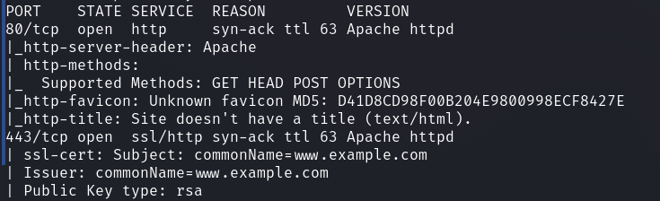
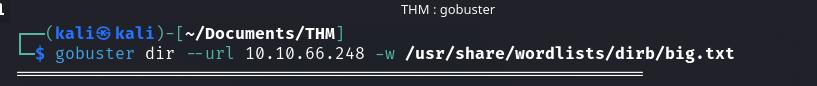
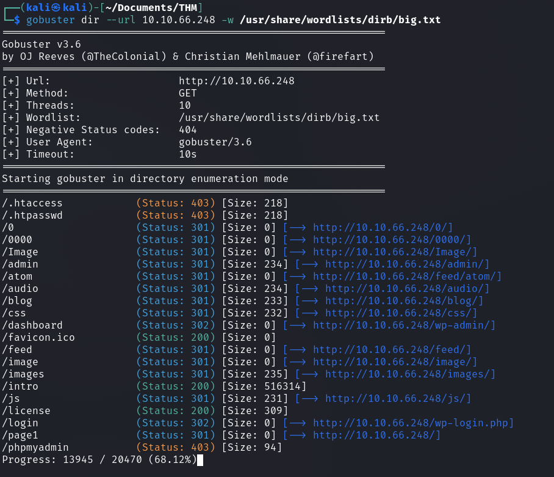
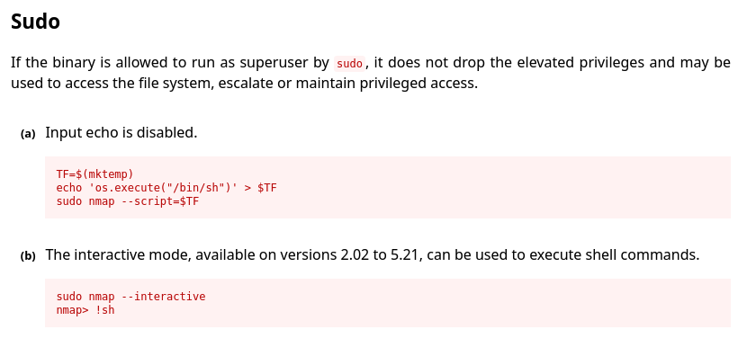
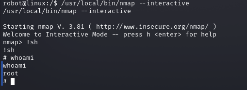
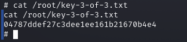

# Proceso para conseguir la user.txt:
Vamos a realizar un escaneo de puertos desde la maquina atacante:

  ```bash
sudo nmap -p- -open -sV -sC -sS --min-rate 5000 -n -Pn -vvv <ip-victima>
```

Hemos obtenido:

<div style="text-align: center; ">
    
  </div>

Tenemos dos protocolos http (80) y https(443), podemos acceder a ella introduciendo la ip en la barra del buscador de nuestro navegador.

Vamos ver si hay directorios ocultos, mediante fuzzing con gobuster:

<div style="text-align: center; ">
    
  </div>

Y vamos a ver que directorios escondidos tiene la pagina web:

<div style="text-align: center; ">
    
  </div>

Primero de todo, toda página web contiene el directorio */robots.txt* por tanto vamos a echarle un ojo:

<div style="text-align: center; ">
    
</div>  

Encontramos la primera key, que la podemos ver accediendo desde la barra de navegación o haciendo un curl desde la consola:
<div style="text-align: center; ">
    
</div>  

Hemos encontrado un directorio */dashboard* que en verdad es el directorio admin de un wordpress */wp-admin* vamos a hacerle un curl a ver que enconrtamos:

<div style="text-align: center; ">
    
</div>  

Encontramos un panel de login, para ello necesitamos obtener un user y contraseña.

También hemos encontrado un directorio *license* que si accedemos a el vamos a encontrar al final del todo una contraseña, hacemos un curl a dicho directorio y obtenemos el user y la contraseña:

<div style="text-align: center; ">
    
</div>  

Está en base64 , por tanto, vamos a convertirlo y obtenemos la contraseña y el usuario

<div style="text-align: center; ">
    
</div>  

Ahí tenemos las credenciales, vamos a iniciar sesión:

<div style="text-align: center; ">
    
</div>  

Estamos dentro, ahora vamos a proceder a buscar las demás keys.

Como sabemos wordpress corre bajo php, por tanto, vamos a realizar una revershell php para poder acceder y tener ejecución remota de comandos, mediante un script encontrado en github [Pentestmonkey-php-reverse-shell](https://github.com/pentestmonkey/php-reverse-shell)

Ahora pegamos el script encontrado en github en la seccion Appearance → editor →archive:

<div style="text-align: center; ">
    
</div>  

Ahora abrimos un puerto para realizar la escucha mediante netcat y modificamos el script introducido anteriormente con nuestra IP y el puerto seleccionado para realizar la escucha:

<div style="text-align: center; ">
    
</div>  


<div style="text-align: center; ">
    
</div>  


Realizamos la revershell y estamos dentro.

Ahora vamos a buscar las demás keys, vamos a comprobar que una de ellas sea del tipo .txt, por tanto vamos a buscarla.

<div style="text-align: center; ">
    
</div>  


Buscamos todos los archivos que terminen en la extensión .txt, y vemos que en el directorio */home* encontramos la segunda key.

<div style="text-align: center; ">
    
</div>  


Hacemos un cat para obtenerla, pero nos dice que no tenemos permisos y en efecto, solamente tiene permiso de lectura el root.

<div style="text-align: center; ">
    
</div>  


Además de la key, el home encontramos otro fichero, que es una password:

<div style="text-align: center; ">
    
</div>  


[Crackstation](https://crackstation.net/):

<div style="text-align: center; ">
    
</div>  


Ahí tenemos nuestra contraseña, para poder escalar de privilegios a root.

Ahora hacemos sudo su y ponemos la password.

<div style="text-align: center; ">
    
</div>  


Primero hacemos un tratamiento de la tty, para poder escribir el comando su, para escalar privilegios.

<div style="text-align: center; ">
    
</div>  


ahora somos robot y podemos acceder a la segunda key.

<div style="text-align: center; ">
    
</div>  


Ahora para encontrar la tercera y ultima key, lo que vamos a hacer es tirar otro find donde el nombre sea key-3-of-3.txt, para ver donde se ubica y nos aparece nada, por tanto vamos a buscar binarios:

<div style="text-align: center; ">
    
</div>  


Y encontramos uno que es muy raro que es el de nmap y buscamos una vulnerabilidad en gtfobins de nmap Sudo, para poder hacernos root:

<div style="text-align: center; ">
    
</div>  


Vamos a hacer uso de la ocpión b:

<div style="text-align: center; ">
    
</div>  


Y ya tenemos permisos root, para poder acceder a la tercera y última key, que se encuentra en /root/key-3-of-3.txt

<div style="text-align: center; ">
    
</div>  

Listo, tenemos el ejercicio completado.

---