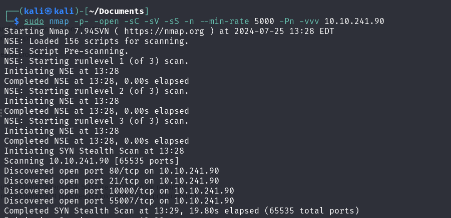

Primero de todo vamos a realizar un escaneo de la red, para ver que puertos tiene abierto:

    

Vamos a ver que es esa web:

    

Vemos que es una página default de un servicio apache, por tanto, vamos a comprobar si existen directorios ocultos.

    

Ya que no hay nada en los directorios ocultos, vamos a intentar iniciar sesión en el servidor ftp, poniendo como *username* A*nonymous:*

    

Lo descargamos y lo abrimos:

    

Vemos que es ilegible, por lo que vamos a hacerlo legible descifrándolo.

Como resultado tenemos: *Just wanted to see if you find it. Lol. Remember: Enumeration is the key!*

Vamos a mirar en el directorio "/robots.txt":

    

Hemos encontrado una serie de números ascii que si los pasamos a base64 y MD5 obtnemos la cadena *kidding* (Una perdida de tiempo vamos..).

Vamos a seguir comprobando cosas:

    

En el directorio "/joomla", no hay nada relevante a simple vista, pero podemos fuzzear la web para buscar directorios ocultos en la misma.

    

En efecto, encontramos una gran cantidad de directorios ocultos dentro del directorio "/joomla".

Vemos que hay un directorio llamado "/_tests", vamos a echarle un ojo:

    

Si buscamos sobre sar2html en Google vamos a encontrar algún exploit en exploit-db que se pueda usar en contra de él. → [exploit-db/Sar2HTML](https://www.exploit-db.com/exploits/47204) (aquí está el exploit).

El exploit nos dice que podemos hacer una ejecución remota de comandos en la barra de navegación debido a `*plot=*`, así que vamos a testearlo:

    

Si hacemos uso de`whoami` , vemos que nos dice que somos www-data (al ser un servidor es correcto), por tanto, vamos a tirar un listado de archivos y ficheros a ver que encontramos:

    

Encontramos varios archivos, pero el más interesante es log.txt, que si hacemos `plot=;cat log.txt` vamos a obtener historial de logins:

    

Por tanto, el usuario es *basterd* y la password es *superduperp@$$*, ahora si podemos realizar una conexión ssh con dichas credenciales:

    

Al entrar vemos un archivo [backup.sh](http://backup.sh), si lo abrimos, encontramos el *user* y *password* de otro usuario,  vamos a pivotar de usuario haciendo `su stoner` y poniendo su contraseña `superduperp@$$no1knows`, ahora si hacemos cd .. , vemos su directorio y podemos acceder a él.

Ya tenemos la user_flag:

    

Suponemos que la flag está en el root, por tanto, vamos a escalar privilegios.

Vamos a comprobar si stoner puede ejecutar algún binario mediante `sudo -l` :

    

Fuimos engañados otra vez, así que ahora vamos a comprobar si algún binario tiene el SUID activado:

    

Vemos que el binario a usar es el */find* buscamos en Google de ejecutar el exploit y ganamos acceso:

    

Listo hemos encontrado la root_flag así que hemos acabado el reto.

---