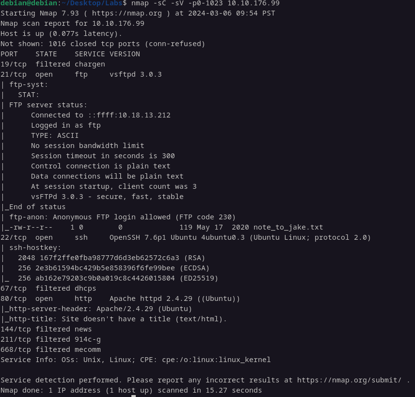

# User.txt

Vamosa proceder a escanear los primeros 1024 puertos para enumerarlos:

    

Escaneamos la pagina web → no hay nada

    

Descargamos el archivo y lo abrimos

    

    

Hacemos un ataque de fuerza bruta con el user jake a la conexion shh y sacamos la contraseña:

    

Iniciamos sesión en ssh

    

Estamos dentro y buscamos la user.txt

    

# Root.txt

Vamos a sacar vulnerabilidades de root

    

Vemos que tiene permiso para ejecutar comando con less, buscamos un exploit

    

y escribimos `!/bin/sh` y somos root

    

Listo:

    

---
