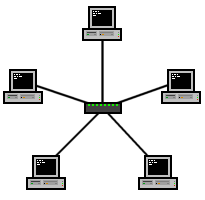

# Topologías de las redes LAN

> Local Area Network o LAN es una red privada que permite la comunicación e intercambio de datos entre dispositivos a nivel local (distancias cortas).

En redes, cuando nos referimos a topología, hablamos del diseño que tiene la red. Además, estas redes LAN pueden conectarse con otras mediante **routers**.

Existen varias topologías, cada una con sus ventajas y desventajas:

  <table border="1" style="border-collapse: collapse; width: 100%; text-align: left;">
    <thead>
      <tr>
        <th style="padding: 8px; border: 1px solid #ddd; text-align:center;">Topología estrella</th>
        <th style="padding: 8px; border: 1px solid #ddd; text-align:center;">Topología bus</th>
        <th style="padding: 8px; border: 1px solid #ddd; text-align:center;">Topología anillo o token ring</th>
      </tr>
    </thead>
    <tbody>
      <tr>
        <td style="padding: 8px; border: 1px solid #ddd;">
          Los dispositivos están conectados individualmente a un dispositivo de red central, normalmente un Switch. 
          Es muy fácil agregar más dispositivos, pero si falla el dispositivo central de red, la red se cae y los dispositivos dejan de estar conectados, impidiendo el envío o recepción de datos.
          

            
          

        </td>
        <td style="padding: 8px; border: 1px solid #ddd;">
          Los dispositivos están conectados a un bus de datos, similar a las hojas en una rama. 
          Son fáciles de configurar y mantener, pero puede haber cuellos de botella a la hora de compartir muchos datos, lo que puede afectar el rendimiento de la red.
          

            
          

        </td>
        <td style="padding: 8px; border: 1px solid #ddd;">
          Los dispositivos están conectados entre sí en una especie de anillo, donde los datos solo viajan en una dirección. 
          Es fácil identificar y solucionar problemas, pero la red puede ser poco eficiente y experimentar cuellos de botella.
          

            
          

        </td>
      </tr>
    </tbody>
  </table>

## ¿Qué es un Switch?

> Los Switches son dispositivos dedicados en las redes, encargados de conectar múltiples dispositivos como ordenadores, impresoras y otros capaces de usar Internet. Los switches tienen una serie de puertos donde se conectan estos dispositivos.

Son mucho más eficientes que los ***Hubs*** o ***Repeaters*** debido a que el switch mantiene un seguimiento de los dispositivos conectados y los puertos, enviando los paquetes específicamente al dispositivo destinatario, a diferencia del Hub/Repeater que envía el paquete a todos los puertos.

En una *red con topología de estrella* encontramos que los dispositivos están conectados a un switch.

## ¿Qué es un Router?

> Los routers son dispositivos encargados de conectar redes y pasar datos entre ellas mediante un proceso llamado Enrutamiento.

El *Enrutamiento* es el proceso de crear rutas entre redes para que los datos puedan ser enviados y recibidos correctamente.

Si queremos conectar una red LAN a Internet, el router se conecta con todos los dispositivos de la red LAN y con Internet u otra red LAN.

  

Ejemplo de dos redes LAN conectadas mediante un router.

# Introducción a las Subredes

> **Subnetting** es el proceso de dividir una red “grande” en redes mucho más pequeñas con un fin concreto.

Mediante este proceso, podemos obtener redes más pequeñas de una más grande, dependiendo del número de hosts necesarios. Por ejemplo, la red de una empresa puede dividirse en varias subredes para cada departamento.

Una **dirección IPv4** está formada por 4 octetos. Para realizar el *Subnetting*, utilizamos la máscara de red, que también está formada por 4 octetos y varía de 0 a 255.

Las subredes utilizan las direcciones IP de tres maneras diferentes:

  <table border="1" style="border-collapse: collapse; width: 100%; text-align: left;">
    <thead>
      <tr>
        <th style="padding: 8px; border: 1px solid #ddd; text-align:center;">Tipo</th>
        <th style="padding: 8px; border: 1px solid #ddd; text-align:center;">Propósito</th>
        <th style="padding: 8px; border: 1px solid #ddd; text-align:center;">Explicación</th>
        <th style="padding: 8px; border: 1px solid #ddd; text-align:center;">Ejemplo</th>
      </tr>
    </thead>
    <tbody>
      <tr>
        <td style="padding: 8px; border: 1px solid #ddd;">Dirección de red (Network Address)</td>
        <td style="padding: 8px; border: 1px solid #ddd;">Identifica el inicio de la red actual</td>
        <td style="padding: 8px; border: 1px solid #ddd;">Si un dispositivo tiene como dirección 192.168.1.100, pertenecerá
        a la red 192.168.1.0.</td>
        <td style="padding: 8px; border: 1px solid #ddd;">192.168.1.0</td>
      </tr>
      <tr>
        <td style="padding: 8px; border: 1px solid #ddd;">Dirección Host (Host Address)</td>
        <td style="padding: 8px; border: 1px solid #ddd;">Se usa para identificar un dispositivo en la red</td>
        <td style="padding: 8px; border: 1px solid #ddd;">Un dispositivo tendrá una dirección en el intervalo [.1 - .254]. Las direcciones .0 y .255 están reservadas</td>
        <td style="padding: 8px; border: 1px solid #ddd;">192.168.1.100</td>
      </tr>
      <tr>
        <td style="padding: 8px; border: 1px solid #ddd;">Puerta de enlace (Default Gateway)</td>
        <td style="padding: 8px; border: 1px solid #ddd;">Dirección especial asignada al dispositivo encargado de transmitir y recibir información de otras redes</td>
        <td style="padding: 8px; border: 1px solid #ddd;">Cualquier dato destinado a un dispositivo fuera de la red pasa por la puerta de enlace.  Generalmente, la puerta de enlace tiene una dirección que termina en .1.</td>
        <td style="padding: 8px; border: 1px solid #ddd;">192.168.1.1</td>
      </tr>
    </tbody>
  </table>

La dirección 192.168.0.255 está destinada al *broadcast*.

El *subnetting* ofrece beneficios como eficiencia, seguridad y control total de la red.

# Protocolo ARP

> El protocolo ARP (Address Resolution Protocol) permite que los dispositivos se identifiquen a sí mismos en una red.

  

El protocolo ARP permite a los dispositivos asociar su dirección MAC con una dirección IP en la red. Si un dispositivo desea comunicarse con otro, envía una transmisión a toda la red para buscar la dirección MAC del dispositivo de destino.

Cada dispositivo contiene una caché donde almacena los identificadores de otros dispositivos de la red.

- El dispositivo que desea comunicarse envía una ***ARP Request*** para buscar la dirección IP del dispositivo destinatario.
- El dispositivo que contiene la dirección IP solicitada responde con una **ARP Reply**.

Después de establecer la conexión, el dispositivo inicial almacena la información de la conexión en su caché.

# Protocolo DHCP

> El protocolo DHCP (Dynamic Host Configuration Protocol) permite asignar direcciones IP de forma automática cuando un dispositivo se conecta a la red.

  

Pasos para asignar dinámicamente direcciones IP:
1. Cuando un dispositivo se conecta a la red y aún no tiene una IP asignada, envía una solicitud ***DHCP Discover*** para buscar un servidor DHCP en la red.
2. Si hay un servidor DHCP, responde con una dirección IP que el dispositivo puede usar, llamada ***DHCP Offer***.
3. Luego, el dispositivo envía una solicitud de confirmación al servidor DHCP, llamada ***DHCP Request***.
4. Finalmente, el servidor DHCP envía al dispositivo una confirmación de que la dirección IP ha sido asignada y que puede empezar a usarla, llamada ***DHCP ACK***.
