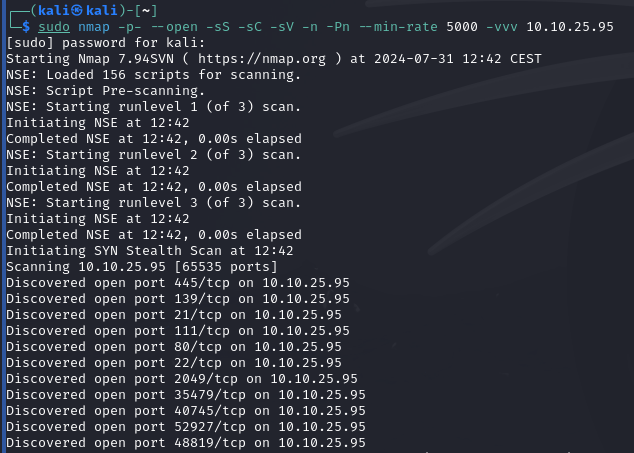
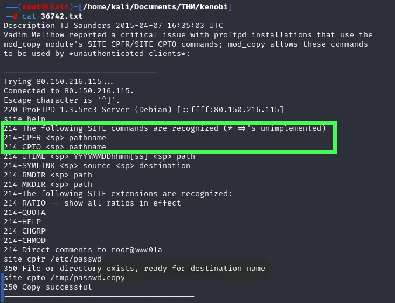
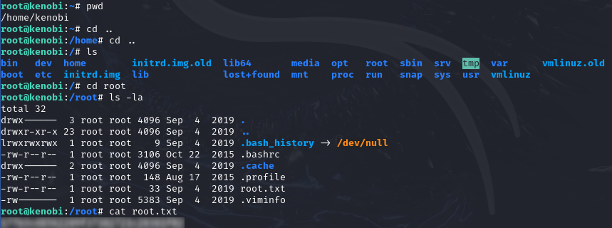

Primero de todo, vamos a realizar un escaneo de puertos de la ip de la máquina víctima:

  <table>
    <tr>
      <td>
        

         
        

      </td>
      <td>
        

          
        

      </td>
    </tr>
  </table>

Vemos que tenemos en el puerto *21* un servicio *FTP* con una versión **ProFTPD 1.3.5**, en el puerto 445 un servicio de recursos compartidos *Samba*, además de un servicio *ssh* en el puerto 22 y también vemos que podemos consultar las monturas de la máquina víctima:

Si hacemos uso de `smbmap -H <ip_maquina>` podemos consultar los recursos compartidos y con `smbclient //ip_maquina/anonymoys -N` podemos navegar entre esos recursos y vemos que hay un fichero `log.txt` que vamos a proceder a descargar:

Con el comando `get`nos descargamos el fichero y lo abrimos en nuestra máquina con `cat nombre_fichero_descargado`:

Este fichero nos indica que hay un usuario “*kenobi*” que ha iniciado sesión mediante un **id_rsa** en una conexión `ssh`.

Si volvemos al escaneo que hemos hecho con Nmap, podemos ver que en el puerto 21 tenemos un servicio *FTP* que está usando ProFTPD en una versión 1.3.5 que puede ser vulnerable, por tanto, mediante la herramienta `searchsploit` podemos buscar vulnerabilidades del servicio.

En efecto, tiene vulnerabilidades y mediante la opción `-m` nos podemos descargar el exploit.

Si abrimos el fichero descargado, encontramos información sobre el exploit y vemos que este nos permite la copia de ficheros del servidor FTP entre directorios cualesquiera:

Si nos conectamos al servicio ProFTPD con netcat y especificamos el puerto (en este caso 21), podremos copiarnos el fichero `id_rsa` en cualquier directorio, en este caso lo hacemos al directorio `/var/tmp` (que es una de las monturas del servidor).

Ahora vamos a obtener dicho fichero, para ello vamos al directorio `/mnt` de nuestra máquina y creamos una montura nueva:

Luego, como podemos ver, insertamos la montura que encontramos en el servidor en la que hemos creado mediante `mount <ip_maquina_victima>:/<recurso_compartido> /nuestra_montura`, donde `<recurso_compartido>` es la carpeta donde hemos movido previamente el fichero **id_rsa**.

Finalmente, si listamos la montura vemos que tenemos en nuestra máquina dicho fichero que podemos usar para realizar la conexión vía `ssh`.

Para ello, le damos permisos de lectura y procedemos a iniciar sesión vía ssh, con las credenciales (usuario *kenobi* y **id_rsa**):

Ahora, que estamos dentro del servidor vamos a buscar las flags, para ello vamos a navegar entre directorios, para ello realizamos un listado con `ls -l` y vemos que no nos hace falta buscar la flag, ya que esta se encuentra en el directorio donde estamos situados.

Ahora nos piden la flag del root, para ello tenemos que escalar privilegios, esto lo hacemos porque aunque la encontremos no vamos a tener los privilegios necesarios para poder consultar su contenido.

Podemos escalar de privilegios de varias manera ([más información aquí](https://joseeelv.github.io//blog/EPL)), como buscar los exploits del kernel, ver los comando que el usuario puede ejecutar como SUDO, ver los binarios que tienen el bit SUID activado (ya que siempre se ejecutan como root), entre otros..

Vemos que no ha habido suerte a la hora de hacer `sudo -l`, asi que vamos a realizar un escaneo de los binarios con el bit SUID activado. Vemos que hemos encontrado un binario `/usr/bin/menu` sospechoso.

Si lo ejecutamos vemos que contiene un menú que ejecuta 3 comandos, estos 3 comandos siempre se ejecutan con privilegios root, debido a que tiene el bit SUID activado:

Como he comentado antes estos 3 comandos siempre se ejecutan como root, así que podemos aprovecharnos de eso, colando dicho binario en el **PATH**, es decir, vamos a realizar un **PATH_Hijacking**, hacemos esto porque si colamos un comando como lanzar una bash esta se ejecutará como root sin nosotros tener dicho privilegio.

Mostramos por pantalla el PATH y exportamos el directorio del binario al PATH y vemos que ya está incluido.

En este caso vamos a incluir una Shell de Bash dentro del comando `ifconfig` (comando número 3 del binario), esto lo hacemos mediante el comando `echo` 

Le damos todos los permisos y lo exportamos al PATH y lo ejecutamos y vemos que se ejecutó la Shell de Bash como root:

Ahora que somos un usuario root, vamos a buscar la flag que nos falta (casi siempre, como en este caso se encuentra en el directorio `/root`).

---