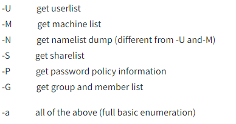

# Protocolo SMB

El *protocolo SMB*  o *Server Message Block protocol* es un protocolo de comunicación cliente - servidor.

Este es usado para compartir acceso a archivos, impresoras, puertos serie y otros recursos en una red.

Los servidores crean archivos del sistema y otros recursos (por ejemplo, impresoras, APIs,..) que están disponibles para los clientes en esa red.

Este protocolo es conocido como **response-request protocol** (protocolo de solicitud-respuesta), el cual transmite múltiples mensajes entre el cliente y el servidor para establecer la conexión.

Hace uso del puerto `TCP 445`, pero también puede hacer uso de los puerto  `TCP 139` y `UDP 137-138`.

## Como funciona SMB:

<div style="text-align: center; ">
    
</div>

Los clientes se conectan a los servidores mediante **TCP/IP.**

Una vez establecida la conexión, el cliente puede mandarle comandos (SMB) al servidor para que este le permita el acceso a los archivos (lectura, escritura, abrir,..), como si de un sistema de archivos se tratara pero en la red.

## Que corre SMB:

**Samba** (lanzado por Unix), es un servidor *open-source* que hace uso del protocolo SMB.

## Como enumerar el protocolo SMB

1. **Uso de herramienta Nmap:**
    
    Podemos realizarlo mediante el uso de la herramienta **Nmap**, el cual si realizamos un escaneo de los puertos de la red, podemos encontrar que el puerto 445 está abierto y se ejecuta un servicio Samba.
    
    Esto lo podemos ver en la room [kenobi de THM](https://joseeelv.github.io//blog/Kenobi).
    
    ```bash
    nmap -p 445 <parametros> <ip-objetivo>
    ```
    
    Si encontramos que el puerto 445 `SMB` está abierto, podemos seguir haciendo uso de Nmap con algunos scripts específicos para listar el servidor SMB:
    
    ```bash
    nmap -p 445 --script smb-protocols <ip-objetivo>
    ```
    
2. **Uso de herramienta Enum4Linux:**
    
    También podemos hacer uso de la herramienta **Enum4Linux** con la sintaxis → `enum4linux [opc] <ip_target>`
    

<div style="text-align: center; ">
    
</div>

## Como explotar el protocolo SMB

Dependiendo de la versión del protocolo podemos encontrar CVEs que nos puedan dar acceso a la ejecución remota de comandos → [CVE-2017-7494](https://www.cvedetails.com/cve/CVE-2017-7494/)

También podemos intentar acceder al servidor remotamente mediante una conexión anónima con la herramienta `smbclient //[ip_target]/[directorio] -[opc]`, haciendo uso de la opción `-N`(que hace uso de una *Null Session*). Esto puede ser muy útil si el servidor no tiene un método de autorización configurado.

### Ejemplo práctico SMB:

Mediante:

```bash
sudo nmap -p- -open -sC -sS -sV -n -Pn -vvv --min-rate 5000 <ip-objetivo>
```

Obtenemos los siguientes puertos y servicios:

<div style="text-align: center; ">
    
</div>
Tenemos los puertos 22 (servicio ssh), 139 y 445 (servicio smb).

<div style="text-align: center; ">
    
</div>
Aquí podemos ver información acerca del servicio smb de los puertos 139 y 445.
<div style="text-align: center; ">
    
</div>

Ahora vamos a explotar el protocolo:

<div style="text-align: center; ">
    
</div>

Como accedemos como Anonymous, ponemos cualquier contraseña ya que no realiza autenticación.

<div style="text-align: center; ">
    
</div>

Ahora, tras haber descargado el **id_rsa** y **id_rsa.pub** vamos a iniciar sesión mediante ssh.

<div style="text-align: center; ">
    
</div>

Encontramos que el usuario es **cactus**

<div style="text-align: center; ">
    
</div>
Tenemos la flag.

# Protocolo Telnet

*Telnet* es un protocolo de aplicación (*application protocol*) que proporciona una comunicación bidireccional interactiva basada en texto entre dos dispositivos a través de una red, generalmente IP.

Por defecto hace uso del puerto `TCP 23`.

Con el uso de un cliente Telnet, podemos conectarnos y ejecutar comandos en una máquina remota la cual hostea el servidor Telnet.

Cuando se realiza la conexión con el servidor Telnet, el cliente se convierte en una terminal virtual que puede interactuar con el host remoto.

En muchas de las implementaciones, Telnet ha sido reemplazado por **SSH**, debido a que **SSH** cifra toda la información transmitida entre el cliente y servidor.

## Como funciona Telnet

Mediante el comando `telnet [ip] [puerto]` nos conectamos al servidor Telnet. Entonces el cliente ejecuta los comandos en el servidor usando una *prompt* del protocolo.

## Como enumerar el protocolo Telnet

Al igual que todos los protocolos, si realizamos un escaneo de los puertos de la red con **Nmap**, podemos encontrar que el puerto 23 está siendo usado y está abierto.

## Como explotar el protocolo Telnet

Telnet, al ser un protocolo no encriptado (la información que se transmite entre el cliente y el servidor se encuentra en texto plano) podemos encontrar CVEs tanto para el cliente como servidor Telnet.

### Maneras de explotar el protocolo Telnet sin CVE:

Sin embargo, podemos encontrar alguna versión de Telnet que no tienen un CVE, por lo que podemos buscar otras maneras de explotarlo como buscar una configuración errónea ya sea en la forma que se ha configurado o ejecutando.

También podemos interceptar credenciales (**Sniffing**) → ya sea con `wireshark` o `tcpdump` donde podemos encontrar credenciales en texto plano.

Otra forma es mediante un ataque de fuerza brutal → mediante `hydra` podemos intentar encontrar un usuario y contraseña para realizar la conexión.

Aunque parezca una tontería, tenemos que tener en cuenta que algunos servicios pueden usar credenciales por defecto, por ejemplo → *admin/admin*.

### Ejemplo práctico:

<div style="text-align: center; ">
    
</div>

Si escaneamos los primeros 1000 puertos, vemos que no hay ninguno abierto.

<div style="text-align: center; ">
    
</div>

Si realizamos la conexión Telnet vemos:

<div style="text-align: center; ">
    
</div>

Es decir, se ha modificado el puerto para hacer uso de un backdoor que pertenece a un tal *Skidy*.

Vamos a crear un payload que contenga una reverse_shell para poder acceder al servidor:

<div style="text-align: center; ">
    
</div>

Iniciamos la reverse shell en nuestra máquina:

<div style="text-align: center; ">
    
</div>

Copiamos el payload en la sesion Telnet:

<div style="text-align: center; ">
    
</div>

Vemos que ha funcionado y estamos dentro:

<div style="text-align: center; ">
    
</div>

# Protocolo FTP

El *protocolo FTP* o *File Transport Protocol*, es ,como su nombre indica, un protocolo que realiza el transporte de archivos a través de la red TCP/IP.

Usa un modelo cliente-servidor para hacer lo anteriormente comentado (cargar y descargar archivos en el servidor).

Contiene una autenticación, por tanto, para acceder a él necesitamos una credenciales (usuario y contraseña), una vez autorizados podemos ejecutar comandos como → `LIST`, `RETR`, `STOR`, `DELE`, etc.

El protocolo FTP hace uso del puerto `TCP 20` y `TCP 21`.

Hay 2 tipos de conexión FTP:

- Conexión FTP activa→ El cliente abre un puerto de escucha, el servidor se tiene que conectar a el cliente de manera activa.
- Conexión FTP pasiva → El servidor abre un puerto de escucha, donde espera que un cliente se conecte.

## Como enumerar el protocolo FTP

Mediante **Nmap** podemos encontrar si el puerto 21 está abierto o no.

```bash
nmap -p 21 <parametros> <ip-objetivo>
```

## Como explotar el protocolo FTP

1. **Uso de CVE y vulnerabilidades:**
Dependiendo de la versión del protocolo podemos encontrar CVEs (mediante el comando `searchsploit` o en Mitre), como es en el caso de la máquina → [kenobi de THM](https://joseeelv.github.io//blog/Kenobi), donde explotamos una vulnerabilidad de ProFTPD (tipo de servidor FTP).

También podemos hacer uso de `metasploit` para ejecutar vulnerabilidades conocidas.
2. **Iniciar Sesión de forma anónima:**
También podemos realizar una conexión al servidor con las credenciales predeterminadas o anónimas (Anonymous):

```bash
ftp> open <target-IP>
Name (<target-IP>:<username>): anonymous
Password: <anonymous>
```

Una vez autorizados podemos navegar sobre el servidor FTP, en busca de información.

1. **Ataque de fuerza bruta:**
Si esto falla, podemos realizar un ataque de fuerza bruta con `hydra` con el fin de encontrar usuarios para acceder al servidor.
2. **Transferencia de archivos maliciosos**
Como este protocolo permite la carga y descarga de archivos, podemos subir un fichero malicioso al servidor que puede contener una **web shell** (una terminal remota donde podemos ejecutar comandos a través de una interfaz web) o una **reverse shell** (El servidor se conecta a nuestro equipo proporcionando acceso remoto a la línea de comando)

### Ejemplo práctico:

Realizamos un escaneo de la ip dada:

<div style="text-align: center; ">
    
</div>
Puertos y servicios abiertos de la máquina víctima:
<div style="text-align: center; ">
    
</div>

Vemos que está corriendo un servicio *vsftpd* en el puerto 21. Como es un servicio del protocolo FTP y este permite conexiones anónimas, vamos a iniciar sesión:
<div style="text-align: center; ">
    
</div>

Perfecto, estamos dentro y vemos que tenemos un archivo de texto, que mediante el comando `get` podemos descargar:

<div style="text-align: center; ">
    
</div>

Lo tenemos descargado en el directorio donde estabamos previamente de iniciar sesión en el servidor *FTP* y haciendo uso de `cat` podemos ver su contenido:
<div style="text-align: center; ">
    
</div>

Tenemos un usuario, vamos a sacar su contraseña con un ataque de fuerza bruta con `hydra` en el servicio `ftp` que tenemos abierto:
<div style="text-align: center; ">
    
</div>

Como resultado tenemos al usuario *mike* (previamente obtenido) con su contraseña descifrada.
Ahora podemos iniciar sesión en el servidor *FTP* como Mike y no como anonimo.

<div style="text-align: center; ">
    
</div>

Finalmente, iniciamos sesión y vemos que tenemos en el servidor un fichero llamado **ftp.txt**, para obtenerlo en nuestra máquina hacemos lo mismo; con el comando `get` lo descargamos y con `cat` lo abrimos y tenemos nuestra flag:
<div style="text-align: center; ">
    
</div>

---
