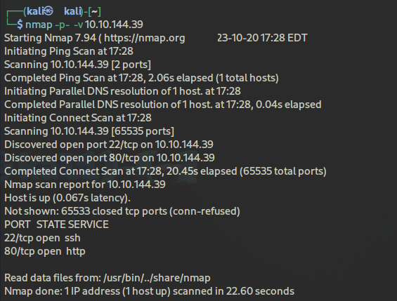

Primero de todo vamos a realizar un escaneo de los puertos para ver que servicios tiene abiertos para aprovecharnos de eso.

  <table>
    <tr>
      <td>
        

          
        

      </td>
      <td>
        

          
        

      </td>
    </tr>
  </table>

Tenemos dos puertos abiertos → 22 (servicio ssh) y 80 (página web mediante http). Vamos a obtener información sobre ellos, vamos primero con el puerto 80 (la página web).

  <table>
    <tr>
      <td>
        

          
        

      </td>
      <td>
      Mediante `gobuster` buscamos directorios ocultos dentro de la web:
        

          
        

      </td>
    </tr>
  </table>

En efecto, hay directorios ocultos, por tanto, vamos a acceder a ellos en especial a `/admin`, donde encontramos un login.

Si leemos el código fuente de la pagina web encontramos un script js correspondiente al login:

  <table>
    <tr>
      <td>
        

          
        

      </td>
      <td>
        

          
        

      </td>
      <td>
      

        
      

      </td>
    </tr>
  </table>

Vamos a login.js. Esta función es la encargada de obtener el user y la password y llevarla al endpoint para la respuesta de confirmación del login.

Si leemos el script, vemos que la función Cookie.set tiene como parámetros la respuesta de cuando se envían las credenciales al endpoint, si mandamos el comando

`Cookies.set("SessionToken", )` iniciaremos sesión sin tener que esperar la respuesta del endpoint.

(*Es la pista que nos da el reto :OWASP Top 10 Vuln! Do NOT bruteforce).*

[OWASP Top 10 Vuln](https://owasp.org/Top10/A07_2021-Identification_and_Authentication_Failures/) hace referencia comentado a lo anterior.

Es decir, que mediante la modificación de las Cookies podemos acceder al área de administración.
Para ello vamos:

  

Arriba creamos una cookie nueva, con el nombre **SessionToken** y Path **"/"**.

  <table>
    <tr>
      <td>
        

          
        

      </td>
      <td>
        

          
        

      </td>
    </tr>
  </table>

Y bingo, estamos dentro, y hemos obtenido el nombre de usuario **James **** y una contraseña la cual está encriptada, para ello vamos a descargarla para que con las herramientas de JohnTheRipper (ssh2john y john) podamos descomprimirla.

Contraseña obtenida!!!!

Por temas de conexión, tuve que reiniciar la maquina 😟

Procedemos a realizar el login shh con el usuario james:

Estamos dentro, ahora vamos a ver los directorios que contiene y a navegar entre ellos.

  

Ahí tenemos el user.txt, además tenemos otro archivo de texto

  

De este archivo podemos sacar información como: 

- La contraseña no es lo suficientemente fuerte
- La contraseña se encuentra en un password manager
- Hay un script automatizado → cron

Sabiendo estas tres cosas vamos a proceder a convertirnos en root

  

Existe un archivo .overpass donde se encuentran unas credenciales.

  

estas están encriptadas asi que vamos a desencriptarlas con el uso de Cyberchef

  

Ahí tenemos algunas credenciales

Ahora vamos a ver la tarea que está automatizada, para ello vamos hasta /etc y hacemos un cat de crontab

  

Donde la tarea automatizada (cada minuto) es `curl overpass.thm/downloads/src/buildscript.sh | bash`.

  

Si le echamos un ojo al archivo de los hosts, vemos que tenemos permisos de lectura y escritura, por tanto, podemos modificar alguno( en esencia overpass.thm) y poner la ip de nuestra vpn.

Hacemos un `ip a`para ver la ip de nuestra maquina.

  

Creamos un directorio downloads/src/buildscript.sh:

  

A continuación creamos un servidor http con el puerto 80.

  

Y ahora situamos un puerto de escucha con netcat, donde nos aparecerá nuestra shell con el root

  

Hacemos un ls y por ultimo un cat para obtener nuestra flag del root

  

---