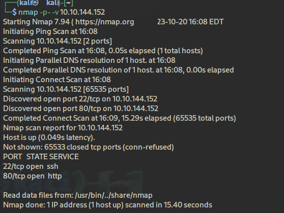
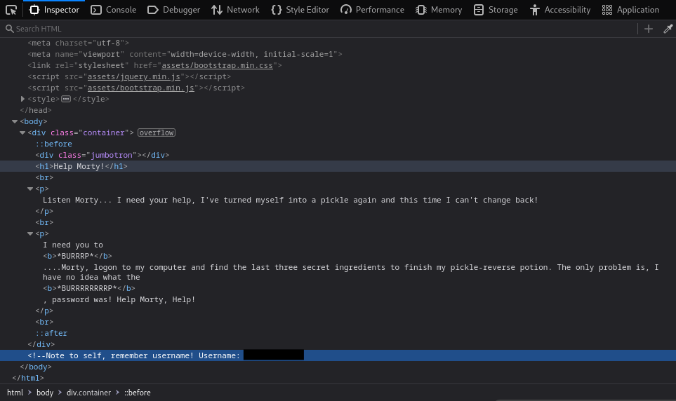
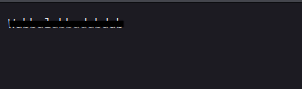
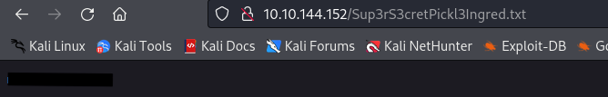

# Task 1: Ingrediente 1

Como hemos leido en la introducción, esta máquina consiste en obtener los tres ingredientes de la poción de Rick.

Primero, vamos a iniciar la máquina y gracias a eso vamos a obtener la IP de la máquina.Para empezar con este laboratorio vamos a hacer uso de la herramienta → ***Nmap.***
Gracias a ella vamos a obtener los puertos que la máquina tiene abiertos para ver si podemos aprovecharnos de eso.

  <table>
    <tr>
      <td>
        

          
        

      </td>
      <td>
        

          
        

      </td>
    </tr>
  </table>

Perfecto, como vemos, tenemos un puerto 80 *http* (pagina web) y puerto 22 un servicio *ssh*. Como no tenemos ninguna credencial para realizar la conexión via *SSH*, vamos a ver que hay en la página web:

  

De momento no encontramos información relevante sobre la página web, pero podemos ver el código fuente de la misma para poder encontrar información.

  

Bingo, tenemos un Username en un comentario. Ahora podemos proceder a realizar un escaneo de directorios de la página web. Mediante `gobuster` podemos realizar una búsqueda de directorios, donde podemos encontrar información.

  

Hemos encontrado el directorio `/assets` y `/robots.txt`. Vamos a acceder a ambos:

  <table>
    <tr>
      <td>
        

          
        

      </td>
      <td>
        

          
        

      </td>
    </tr>
  </table>

En robots.txt hemos encontrado una cadena de caracteres, no sabemos si puede ser un nuevo usuario o una contraseña.

Si tenemos un username y una supuesta contraseña, podemos escribir *ip_maquina/login.php* para verificar si hay un login ya que existe un servicio *SSH* corriendo y podemos iniciar sesión con las credenciales obtenidas.

  

En efecto, hemos podido iniciar sesión con las credeciales. Ahora encontramos como una consola donde podemos introducir comandos; tenemos un RCE (Ejecución Remota de Comandos), por ejemplo, vamos a tirar un listado de los archivos del directorio en el que nos encontramos actualmente mediante `ls -l`:

  

Como vemos al listar los archivos encontramos uno llamado *Sup3rS3cretPickl3Ingred.txt*, por tanto si accedemos a la ruta `<ip_maquina>/nombre_archivo.txt` encontramos la primera flag:

  

# Task 2: Ingrediente 2

El segundo ingrediente no está en este directorio (como es de esperar),por tanto, debemos de navegar por los demás directorios del servidor en busca de ella.

Vamos a ver si nos podemos cambiar de directorios, con `cd ../../../../`, listamos otra vez y vemos que encontramos más directorios, por tanto, tenemos un **path traversal** en el servidor.

  

Hemos encontrado el directorio `/home`, `/root` entre otros, pero estos dos son los más importantes. Vamos a acceder primeramente al directorio `/home` en busca del siguiente ingrediente.

  

WOW, hemos encontrado otros dos directorios, `/rick` y `/ubuntu`. Si accedemos al directorio `/rick`, vemos que hay un archivo que se llama *second ingredients*

  

Perfecto, hemos obtenido el segundo ingrediente de la poción de Rick.

# Task 3: Ingrediente 3

Por último, para poder buscar el tercer ingrediente, debemos de buscar en la carpeta ‘root’ que se encuentra en el directorio donde también se encuentra ‘home’, como he comentado antes.

Pero hay un problema, solo puede acceder a ella usuario que tengan permisos de root, por lo que tendremos que buscar una manera de escalar privilegios para poder acceder a dicho directorio. Si hacemos uso del comando `sudo -l` podemos ver si el usuario actual puede ejecutar algún comando como sudo:

  

Vemos que el usuario actual (www-data) tiene permisos para ejecutar todos los comandos como root → `(ALL) NOPASSWD: ALL`.

Una cosa interesante es que haciendo `sudo su`no hacemos nada, si no que tenemos que realizar una lectura del archivo con privilegios root.

  

Finalmente encontramos el archivo que contiene el tercer ingrediente llamado *3rd.txt*, donde ejecutamos el comando → `sudo less /root/"3rd.txt"`, podremos ver su contenido debido a que ese comando se ejecuta con privilegios root.

---