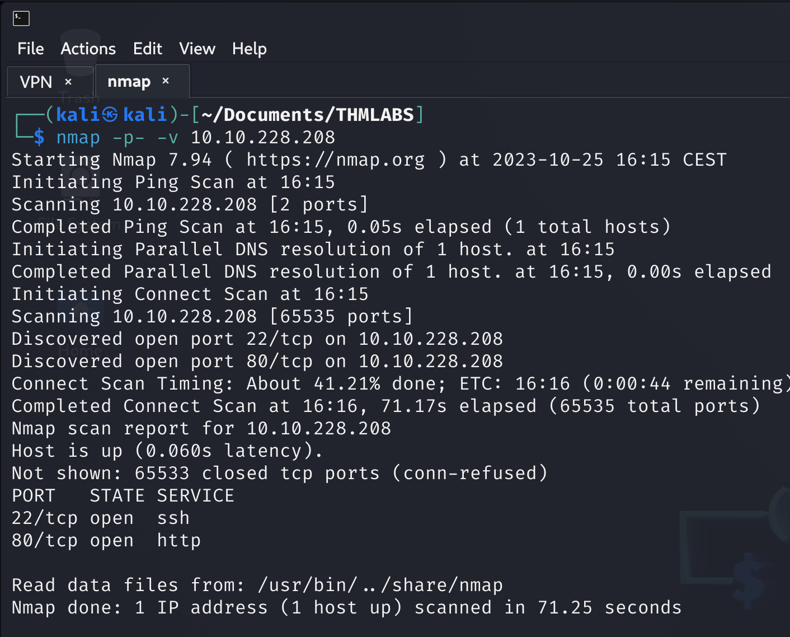
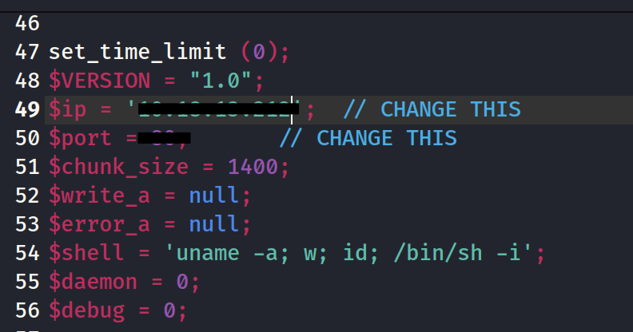
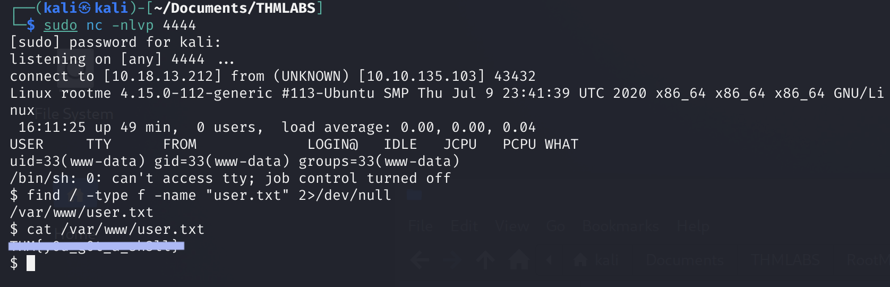
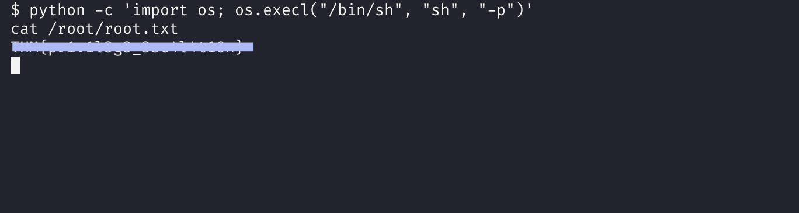

# Task 2: Reconnaissance

Lo primero que vamos a hacer va a ser realizar un escaneo de la ip de la máquina dada.

  <table>
    <tr>
      <td>
        

          
        

      </td>
      <td>
        

          
        

      </td>
    </tr>
  </table>

Vemos que tenemos información sobre los puertos 80 *HTTP* y 22 *SSH*. Como no tenemos ninguna credencial para iniciar sesión en el servidor mediante *ssh* vamos a buscar información en la web que nos ofrece el puerto 80.

  

Accedemos a la web pero no vemos nada a simple vista, para poder buscar información vamos a hacer **fuzzing** que consiste en sacar directorios ocultos de una web ,para ello hacemos uso de `gobuster`(una de las tantas herramientas que hay para hacer fuzzing).

  

Nice, hemos encontrado una gran cantidad de directorios ocultos, vamos a ver en que consiste cada uno accediendo a ellos:

## Directorio /css y /js

  <table>
    <tr>
      <td>
        

          
        

      </td>
      <td>
        

          
        

      </td>
    </tr>
  </table>

Ambas contienen archivos de configuración de la página web.

## Directorio /panel

  

Desde aquí podemos subir archivos a la página web.

## Directorio /uploads

  

Vemos todos los archivos que hemos subido al sitio web, que todavía no hay ningun archivo subido.

# Task 3: Getting a shell

En la task anterior hemos encontrado mediante `gobuster`varios directorios ocultos. Los más importantes son `/panel` (subir archivos) y `/uploads`(acceder y abrirlos).

Podemos buscar en Google sobre como subir un archivo “web shell” que realize una reverse-shell.

Yo he buscado en Google *reverse-shell php* de pentestmonkey → [véase aquí](https://pentestmonkey.net/tools/web-shells/php-reverse-shell).

  

Descargamos el archivo .tar.gz que contiene un script en php, procedemos a editar algunos parámetros, para poder hacer que se realice la reverse-shell:

  

Donde en ***$ip*** (ip de nuestra maquina), ***$port*** (puerto de escucha del netcat).

Primero, en nuestra máquina vamos a habilitar con `netcat` un puerto (puerto que hemos indicado en el script anterior) el cual el servidor se conectará.
Ahora, procedemos a que el servidor reciba dicho archivo mediante `curl http://ip_victima/uploads/nombre_archivo`, y como vemos lo tenemos subido.

  <table>
    <tr>
      <td>
        

          
        

      </td>
      <td>
        

          
        

      </td>
    </tr>
  </table>

Vemos que empieza a escuchar, hasta que ejecutemos el script subido. Y vemos que realiza la reverse shell y estamos dentro del servidor:

  

Al hacer el `ls` encontramos muchos directorios, y tenemos que buscar tanto el ‘*user.txt*’ como ‘*root.txt’.*

Para buscar el ‘*user.txt*’, vamos a hacer uso del comando `find ruta -type f -name "nombre_archivo" 2> /dev/null` donde ruta será `/` (raíz), `-type f` (el tipo del archivo), `-name "nombre_archivo"` (nombre del archivo a buscar) y `2> /dev/null` (los errores los manda al /dev/null).

Como resultado:

  

Hacemos uso de cat y hemos encontrado la flag de user.txt

# Task 4: Privilege escalation

Finalmente, necesitamos obtener la flag perteneciente a *‘root.txt*’, para ello necesitamos escalar privilegio para poder acceder al directorio y conseguir la flag.

Hay muchas maneras de poder escalar privilegios, por ejemplo, podemos hacer un `sudo -l` y ver que comandos puede ejecutar el usuario como root.

También podemos realizar una búsqueda de los binarios que tienen el bit SUID activado, esto hace que esos binarios siempre se ejecuten con privilegios root.

Sea la búsqueda de binarios con el bit SUID: `find / -type f -user root -perm -u=s 2>/dev/null` . Donde `-user` (nos especifica el usuario), `-perm -u=s`(busca los archivos que tengan establecido el bit SUID “Set User ID” en sus permisos), ademas busca desde el directorio raiz y archivos que son ficheros.

  

Vemos que el binario `/usr/bin/python` tiene el bit SUID activado, esto es muy raro, ya que python por defecto no tiene dicho permiso. Mediante la página web [GTFObinsPythonSUID](https://gtfobins.github.io/gtfobins/python/#suid) podemos buscar información de python en SUID:

  

En la shell vamos a hacer uso del segundo comando, ya que nos permite escalar privilegios de root mediante python.
Una recomendación es hacer uso de toda la ruta, en vez de poner solamente `python` es mejor poner `/usr/bin/python`.

  

Perfecto, hemos escalado privilegios y somos root.

Para acabar, tiramos un `cat /root/root.txt` para ver así la flag.

  

---