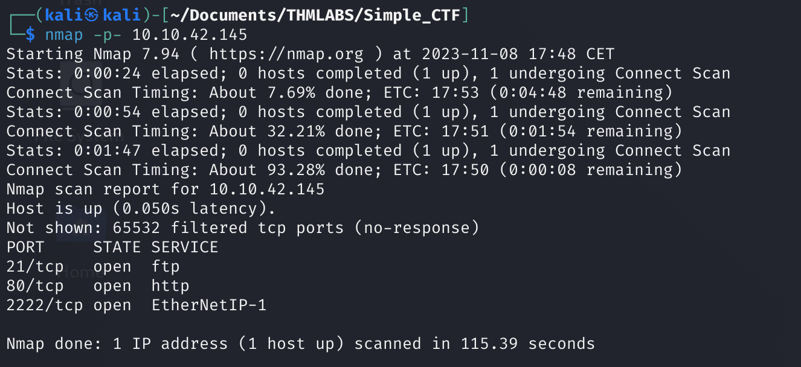

# User.txt
Primero de todo vamos a realizar un escaneo de puertos mediante el uso de la herramienta `nmap` para ver que información podemos encontrar:

  <table>
    <tr>
      <td>
        

          
        

      </td>
      <td>
        

          
        

      </td>
    </tr>
  </table>

Finalmente, encontramos que el puerto 80 *HTTP* es una página web y por tanto vamos a acceder a ella, además encontramos un puerto 21 *FTP* protocolo para enviar archivos y un puerto 2222 que está siendo como servicio *SSH*.

De primeras descartamos el inicio de sesión al servidor mediante *SSH* debido a que no tenemos las credenciales, pero tenemos una página web y un servidor *FTP*. Comenzaremos por la página web donde haremos **fuzzing** para descubrir directorios ocultos de la misma:

Primero accedemos a la web y vemos que estamos ante una página por defecto de Ubuntu, donde no hay información relevante.

  

Como hemos comentado antes, vamos a relizar una enumeración de los directorios ocultos de la web → `gobuster dir -url <ip_maquina> -w <wordlist_a_usar>`

  

hemos encontrado varios directorios como `/robots.txt` y `/simple`:

  <table>
    <tr>
      <td>
        

        <h1>/robots.txt</h1>
          
        

      </td>
      <td>
        

        <h1>/simple</h1>
          
        

      </td>
    </tr>
  </table>

En efecto, esto nos lleva a otra web, a ver si podemos encontrar información.

  

Vemos que encontramos una linea de texto que dice '*If this is your site click [here]() to login*'. Si pinchamos en *here* encontramos un panel de login.
Corresponde a un **CMS** (software que permite a los usuarios crear, gestionar y modificar contenido en un sitio web sin necesidad de conocimientos técnicos profundos en programación), pero estos pueden presentar alguna vulnerabilidad.

Vamos a hacer uso de la herramienta *searchsploit* para buscar las vulnerabilidades, pero para ello tenemos que saber la versión del CMS que la podemos consultar inspeccionando la página web.

  

Vamos a la web que contiene el script y lo descargamos, medianto el comando `searchsploit -m PATH`.

Si ese script no nos funciona, podemos hacer uso de este también -> [CVE-2019-9053-Python3](https://github.com/pedrojosenavasperez/CVE-2019-9053-Python3). Esto puede suceder debido a que el anterior solo funciona en python2.7.

Mediante `python3 exploit.py -u <url> --crack -w <ruta_wordlist>` vamos a comprobar si el script del exploit funciona y tener la password, donde `-u` (url de la web), `—crack`(indicamos que vamos a proceder a crackear una password), `-w` (parámetro para la wordlist).

  

Gracias a esto, hemos conseguido un usuario y su contraseña, pero esta está cifrada, la desciframos haciendo uso de una web y luego, realizamos una conexión ssh con las credenciales que hemos obtenidos:

  

Estamos dentro del servidor y podemos hacer una búsqueda con `find / -type f -name user.txt 2>/dev/null` y esto nos devuelve donde se encuentra la flag.

  

Hemos encontrado la flag.

Si hacemos `cd ..` encontramos los directorios *mitch*(se encuentra la user.txt) y *sunbath*.

# Root.txt

Vamos a acceder al directorio sunbath con `cd sunbath` , nos salta un error de que no tenemos permisos para acceder al mismo, es decir, tendremos que buscar una manera de escalar privilegios. Podemos hacerlo de varias maneras pero en primera instancia podemos probar a ver que comandos puede ejecutar como root el usuario mitch → `sudo -l`:

  

Vemos que mitch puede ejecutar como root el comando `/usr/bin/vim` para saber como explotar esto vamos a [GTFObins-Vim-Sudo](https://gtfobins.github.io/gtfobins/vim/#sudo) para poder obtener información sobre el exploit.

  

Ahora realizamos el exploit y hacemos `bash` para poder poner una consola normal y buscamos la flag.

  

---