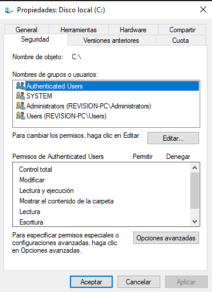
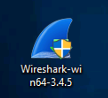
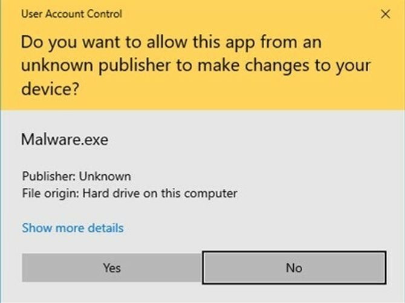

> En esta parte comenzaremos a aprender sobre Windows Desktop, el sistema de ficheros NTFS, como hacer uso del administrador de tareas y más.

# Introducción a Windows

Windows es un S.O complejo debido a que contiene muchos archivos de sistema, utilidades, configuraciones, características, etc..

Fue creado en 1985 y actualmente es el S.O dominante tanto en el uso doméstico como en redes corporativas (empresas). Debido a esto, Windows siempre ha sido el blanco de los hackers y programadores de malware.

# El protocolo RDP (Remote Desktop Protocol)

Nos permite una conexión o ejecución de una aplicación entre una terminal y un servidor Windows. Es muy popular en las máquinas que tienen como S.O Windows.
Mediante este protocolo haremos la room de tryhackme.

# Sistema de ficheros NTFS

  <table>
    <tr>
      <td style="width:65%;">
      Antes de NTFS se hacia uso de FAT32 (tabla de asignación de archivos) y HPFS (sistema de archivos de alto rendimiento).  
      Hoy en día se sigue haciendo uso de particiones FAT en dispositivos USB, tarjetas microSD, pero no en computadoras.  
      NTFS se conoce como un sistema de archivos de registro diario. Si hay un fallo el sistema puede reparar automáticamente las carpetas o archivos perdidos o dañados haciendo uso de la información almacenada en un archivo de registro. Esto no es posible en FAT.  
      Es decir, NTFS aborda muchos de las limitaciones que presentaba FAT, como por ejemplo:
      <ul>
        <li>Admite archivos de más de 4GB.</li>
        <li>Se pueden establecer permisos específicos en carpetas o archivos: Control total,modificar, leer, ejecutar, escribir, etc.</li>
        <li>Permite la compresión de carpetas y archivos.</li>
        <li>Contiene cifrado (EFS).</li>
      </ul>
      Si clicamos con el botón derecho del ratón en un fichero y vamos a la pestaña de propiedades y seguido de la pestaña de seguridad podremos ver los permisos y los grupos que tienen permisos en el mismo.  
      Otra característica de NTFS son los flujos de datos alternativos (ADS).  
      ADS es un atributo de archivo específico de Windows NTFS que permite que los archivos contengan más de una secuencia de datos.  
      De forma nativa el explorador de archivos de Windows no muestra ADS al usuario, pero la Powershell si le brinda la capacidad al usuario de poder ADS con <code>$DATA</code>.
      Esto hacer que los hackers hagan uso de los ADS para ocultar datos e introducir malware dentro de la máquina.</td>
      <td>

          
        

        Ejemplo de las propiedades de un Disco Duro que contiene el Sistema Operativo Windows.
      </td>
    </tr>
  </table>

# Carpetas Windows\System32

La carpeta Windows contiene el sistema operativo Windows.
Se encuentra en `c:\Windows`

La carpeta no tiene que residir necesariamente  en la unidad C, puede residir en una unidad que nosotros le indiquemos a la hora de instalar el S.O.

En esta carpeta encontramos la carpeta System32 la cual contiene archivos muy importantes que son críticos para el sistema operativo.
Si se eliminan archivos dentro de System32 puede hacer que el S.O Windows no funcione.

# Control de cuentas de usuario

  <table>
    <tr>
      <td style="width:50%;">
      La gran mayoría de los usuarios son administradores locales, es decir, que pueden realizar cambios en el sistema (root en Linux).  
      Un usuario no necesita unos privilegios altos para ejecutar tareas como navegar por internet, hacer uso de documentos Word, entre otros, haciendo que el sistema sea más vulnerable a la hora de ser infectado con malware.  
      Para protegernos de esto, Microsoft introdujo el Control de cuentas de usuario (UAC). Esto hace que cuando se inicie sesión como administrador, los permisos que tiene el usuario no son tan elevados, cuando una aplicación necesita de un nivel superior de privilegios para ejecutarse el propio sistema informa al usuario mediante un cuadro de confirmación si se permite o no la ejecución.  Si nos aparece este icono de escudo, significa que la aplicación requerirá de privilegios de nivel superior:
      

          
        

      </td>
      <td>
        

          
           Ejemplo de un aviso de confirmación de ejecución.
        

      </td>
    </tr>
  </table>

# Administrador de tareas

El Administrador de tareas nos proporcionará información sobre las aplicaciones que se están ejecutando en el sistema, en la pestaña procesos.

Encontramos información adicional como el uso de CPU, GPU, memoria RAM las cuales se incluyen en la pestaña rendimiento.

---