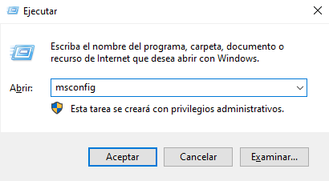
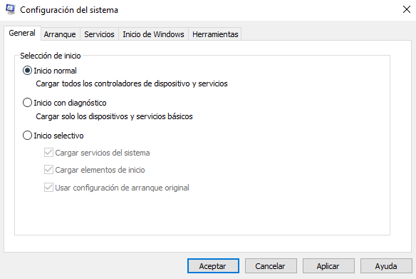
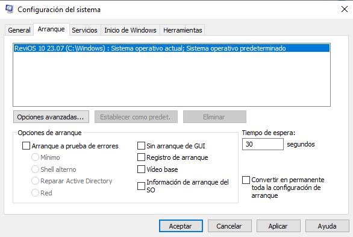
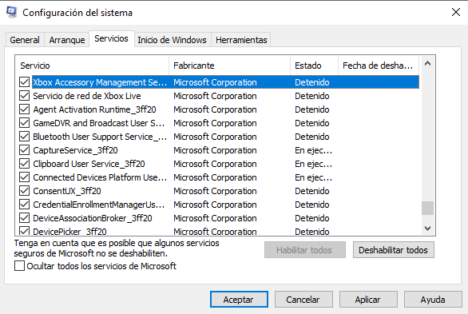
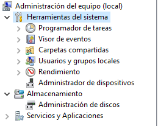
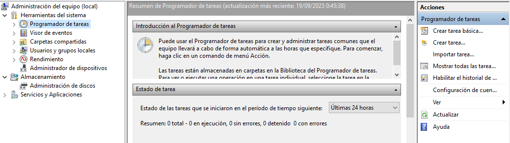
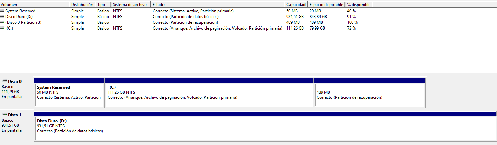
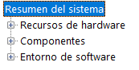

> En esta parte vamos a ver sobre las Configuración del sistema, Configuración de UAC, supervisar recursos, el registro de Windows, etc.

# Configuración del sistema

  <table>
    <tr>
      <td style="width:50%; vertical-align:top;" >
        <code>MSConfig</code> se usa para la solución avanzada de problemas y su objetivo principal es ayudar a diagnosticar problemas de inicio.  Para acceder a la configuración del sistema primero pulsamos las teclas <strong>Windows+R</strong> y tecleamos <code>msconfig</code>, así accederemos a la pestaña de configuración del sistema.
      </td>
      <td>
        

          
        

      </td>
    </tr>
  </table>

Después de realizar esto nos aparecerá una ventana que contiene 5 pestañas: 
<ul>
  <li><strong>General</strong>: Podemos seleccionar el tipo de inicio que tendrá la computadora, seleccionando si queremos que cargar servicios del sistema o elementos de inicio.</li>
  

    
  

  <li><strong>Arranque</strong>: Podemos definir varias opciones de arranque para el propio sistema operativo como por ejemplo, que se inicie sin la interfaz de arranque.</li>
  

    
  

  <li><strong> Servicios</strong>: Encontramos todos los servicios del sistema ya sean de Windows o de programas de terceros.</li>
  

    
  

  <li><strong>Inicio de Windows</strong>: Solo nos muestra una pantalla del administrador de tareas donde se encuentran que procesos se iniciarán cuando se arranque el sistema operativo, pudiendo así seleccionar si queremos que se ejecuten o no.</li>
  
  <li><strong>Herramientas</strong>: Encontramos todas las herramientas que podemos ejecutar para seguir configurando aun más el sistema operativo.</li>
  
</ul>

# Cambiar configuración de UAC

Es una de las herramientas que se encuentran en el apartado de 'Herramientas' de la **Configuración del sistema**.

El Control de cuentas de usuario (UAC) se puede cambiar o desactivar por completo (algo no recomendable).
Para acceder a la configuración del control de cuentas solo basta con escribir UAC en la barra de búsqueda.

Encontramos una barra deslizante que nos permite configurar varios grados de notificaciones.

# Administración de equipos

Es otra herramienta pertenecientes a la **Configuración del sistema**.

`Compmgmt` ó Administración de equipos contiene tres secciones principales:

  <table>
    <tr>
      <td style="text-align:left; vertical-align:top; width:70%;"><ol>
        <li>Herramientas del sistema.</li>
        <li>Alamacenamiento.</li>
        <li>Servicios y aplicaciones</li>
      </ol></td>
      <td>
        

          
      
</td>
    </tr>
  </table>

## Herramientas del sistema

Encontramos el **Programador de tareas** con el cual podemos crear y gestionar tareas (ejecutar una aplicación, un script, ..) comunes que nuestro ordenador llevará a cabo automáticamente en los momentos que se especifique (al inicio o fin de sesión, en un horario determinado,..) muy parecido a `cron` de Linux.

Para crear una tarea cualquiera vamos a **Acciones** que se encuentra en el panel derecho y clicamos en 'Crear tarea'.

  

Ahora el **Visor de eventos** nos permite visualizar los eventos que se han producido en el equipo, estos registros pueden servir para comprender la actividad del sistema.
El visor contiene tres paneles:

- El de la izquierda muestra un árbol jerárquico de los proveedores de los registros de evento.
- En del centro muestra una descripción general y un resumen de los eventos.
- El de la derecha es el panel de acciones.

En **Carpetas compartidas** encontraremos una lista completa de los recursos y carpetas compartidas donde otros pueden conectarse, en **Sesiones** encontramos una lista de usuarios que están conectados a los recursos compartidos y en **Archivos abiertos** están las carpetas/archivos a los que acceden los usuarios.

En **Usuario y grupos locales** encontramos los usuarios y los grupos del equipo, véase en [Aspectos Básicos de Windows I](https://joseeelv.github.io//blog/WindowsI)

En **Rendimiento** encontramos el Monitor de rendimiento `perfom`, este se utiliza para ver los datos de rendimiento en tiempo real o desde un archivo de registro, es una buena manera de solucionar problemas orientados al rendimiento ya sea en equipos locales o remotos.

El **Administrador de dispositivos** nos permite ver y configurar el hardware del equipo, también podemos deshabilitar, buscar actualizaciones de drivers..

## Almacenamiento

Aquí están las **Copias de seguridad de Windows Server** y **Administración de discos**.

En la Administración de discos podemos realizar tareas avanzadas de almacenamiento:

- Configurar una nueva unidad de almacenamiento.
- Extender o reducir una partición.
- Asignar o cambiar un letra de unidad.

  

## Servicio y aplicaciones

Encontramos todos los **servicios** del sistema (aplicación que se ejecuta en segundo plano).
Podemos ver las propiedades, habilitar o deshabilitar un servicio.

Por otro lado, se encuentra el **Control WMI** (Instrumental de administración de Windows),actualmente en desuso debido a que la **Powershell** reemplaza esta herramienta.

# Información del sistema

`Msinfo32` recopila información sobre la computadora y muestra una vista completa del hardware, software y componentes del sistema de la misma.

Esta información la podemos dividir en varias secciones:

  <table>
    <tr>
      <td style="text-align:left; vertical-align:top;"><ol>
        <li>Recursos de hardware.</li>
        <li>Componentes.</li>
        <li>Entorno de software.</li>
      </ol></td>
      <td style="text-align:center; vertical-align:top;">
        

          
        

        En la pestaña por defecto Resumen del sistema encontramos información sobre el equipo.
      </td>
    </tr>
  </table>

## Recursos de hardware

Contiene información sobre el hardware del equipo, esta información no es para un usuario casual. 

  

## Entorno de software

En esta sección, podemos ver información relacionada con el sistema operativo, además del software instalado.
También encontramos las *variables de entorno* (situada en la carpeta Windows\System32 vista en **enlace a pagina**) y *conexiones de red*.

  

### Variables de entorno

Almacenan datos que utilizan tanto el sistema operativo como las aplicaciones instaladas en el sistema.

Por ejemplo, la variable `PATH` contiene la dirección/ruta del archivo ejecutable.

Otra manera de acceder a las Variables de entorno mediante el panel de control
*Panel de control → Sistema y seguridad → Sistema → Configuración avanzada del sistema → Variables de entorno.*

## Componentes

Aquí podemos ver la información específica de los componentes hardware del sistema.

  

# Monitor de recursos

`Resmon` muestra información sobre la CPU, memoria, discos y red, además proporciona información sobre procesos.

Podemos iniciar, detener, pausar y reanudar servicios y cerrar aplicaciones cuando no respondan en la interfaz de usuario (GUI).
También podemos ver información sobre procesos estancados y conflictos de bloqueos de archivos.

# Símbolo del sistema

El `cmd` es la consola de Windows, **NO** hace uso de los mismos comandos de Linux a diferencia de la *Powershell*, hay algunos comandos que son iguales pero en líneas generales no.

Esta línea de comandos es muy potente a la hora de interactuar con el sistema operativo, ya que podemos obtener información sobre el equipo, de la red y más.

El comando `hostname` nos devuelve el nombre del equipo, `whoami` nos devuelve el nombre del usuario, el comando `ipconfig` muestra la configuración de la dirección de red del equipo.

El manual de ayuda de cualquier comando se realiza: `nombre_comando /?`, esto nos mostrará información sobre el comando `ipconfig`.

Para borrar lo mostrado por pantalla escribimos el comando `cls`.

El comando `netstat` muestra estadísticas del protocolo TCP/IP, `net` se utiliza para administrar los recursos de la red (permite subcomandos).

# Editor de registro

`Regedit`, según Microsoft, es una base de datos jerárquica central que se utiliza para almacenar información para configurar el sistema para uno o varios usuarios, aplicaciones y dispositivos hardware.

Este registro contiene información sobre perfiles de usuario, aplicaciones instaladas en el sistema, hardware del sistema, puertos que se están utilizando. Windows hace referencia de esta información continuamente.

Realizar cambios en el registro puede afectar a las operaciones normales de la computadora, es decir, el registro está orientado a usuarios avanzados del sistema.

  

---