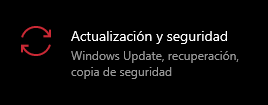

> En la última parte veremos herramientas integradas en Windows para mantener los equipos seguros como Windows Update, Seguridad de Windows, BitLocker y más.

# Windows Update

Windows Update es un servicio proporcionado por Microsoft que nos permite instalar actualizaciones de seguridad, nuevas características en los equipos con Windows instalado.

Podemos acceder a Windows Update de dos formas:
<table>
  <tr>
    <td style="text-align:left; vertical-align:top; width:700px"><ol>
        <li>En Configuración en la sección <em>Actualización y seguridad</em>.</li>
        <li>Haciendo uso del uso del comando: <code>control /name Microsoft.WindowsUpdate</code> ya sea en el <code>cmd</code> (<a href="https://joseeelv.github.io//blog/WindowsII">Símbolo del sistema</a>) de la combinación de teclas de Ejecutar `Windows + R` que nos llevará a la Configuración de Windows (arriba).</li>
      </ol>
      

        
      

    </td>
    <td style="vertical-align:top;">
      

        
      

    </td>
  </tr>
</table>

# Seguridad de Windows

La Seguridad de Windows nos ayuda a administrar las herramientas que protegen el equipo y sus datos.
También está disponible en <em>Configuración > Actualización y seguridad</em>.

  

Se usa para realizar escaneos de archivos en la computadora a la hora de comprobar si nuestro equipo contiene malware y más.
Encontramos varias áreas de protección:
<ul>
  <li>Protección contra virus y amenazas.</li>
  <li>Firewall y protección de red.</li>
  <li>Control de aplicaciones y navegadores.</li>
  <li>Seguridad del dispositivo.</li>
</ul>
Además encontraremos varios colores indicadores dependiendo del estado en que se encuentre el equipo, <strong>verde</strong> (equipo protegido), <strong>amarillo</strong> (se sugiere revisar la seguridad del equipo) y <strong>rojo</strong> (equipo necesita atención inmediata).  
En esta sección de <em>Seguridad de Windows</em> podemos realizar escaneos/análisis de los archivos que contiene el sistema para comprobar que el equipo está seguro y ningún archivo es malicioso.

<table>
  <tr>
    <td style="text-align:left; vertical-align:top; width:800px">
      <h2>Tipos de análisis</h2>
      <ul>
        <li><strong>Análisis / escaneo rápido</strong>: comprueba las carpetas donde se pueden encontrar comúnmente las amenazas.</li>
        <li><strong>Análisis / escaneo completo</strong>: se comprueba todas las carpetas, archivos y programas en ejecución que se encuentran en el equipo, este es un análisis mucho más lento pero más seguro.</li>
        <li><strong>Análisis / escaneo personalizado</strong>: el usuario es libre de personalizar el análisis (los archivos o carpetas que se desean verificar).</li>
      </ul>
      <h2>Historial de protección</h2>
      Contiene todas las acciones que <em>Windows Defender</em> ha tomado a la hora de haberse realizado un análisis. 
      Si el antivirus encuentra/detecta un fragmento de malware, este los registrará en el historial de protección.  
      <strong>Amenazas en cuarentena</strong>: estas amenazas se han aislado del sistema y se ha impedido la ejecución en el equipo. Serán eliminadas periódicamente.  
      También podemos realizar las acciones de <strong>quitar</strong> (elimina la amenaza del dispositivo) ó <strong>restaurar</strong> (vuelve a colocar el archivo en la carpeta donde se encontraba y el antivirus lo volverá a detectar como una amenaza).  
      <strong>Amenazas permitidas</strong>: son elementos identificados como amenazas pero se les permite la ejecución en el equipo.
      <h2>Configuración de protección contra virus y amenazas</h2>
      Aquí podemos administrar la configuración de la protección del equipo:
      <ul>
        <li><strong>Protección en tiempo real</strong>: localiza y evita que se ejecute malware en el equipo.</li>
        <li><strong>Protección entregada en la nube</strong>: ofrece una mayor protección y más rápida debido a que el equipo tiene acceso a las definiciones (contenida en la nube) más actualizadas de las amenazas. El equipo no obstante debe de tener conexión a internet para poder acceder a dicha nube.</li>
        <li><strong>Envío automático de muestras</strong>: si el equipo está conectado a la nube, podemos hacer que 'Defender' envíe automáticamente archivos sospechosos a Windows para comprobar si hay amenazas potenciales.</li>
        <li><strong>Acceso controlado a carpetas</strong>: podemos proteger archivos, carpetas, espacios de memoria del equipo de cambios no autorizados provocado por aplicaciones de terceros.</li>
        <li><strong>Exclusiones</strong>: podemos indicarle a 'Defender' una serie de carpetas de confianza las cuales no analizará.</li>
        <li><strong>Notificaciones</strong>: 'Defender' nos enviará notificaciones cuando encuentre alguna amenaza en el sistema para que se realice una acción frente a ella y del estado del equipo.</li>
      </ul>
      <h2>Protección frente a ransomware</h2>
      <blockquote>
        
<em>Un ransomware es un tipo de malware dedicado a la encriptación de carpetas, archivos o equipos al completo con el fin de obtener los datos del usuario infectado.</em>

      </blockquote>
      Para ello, <em>Windows Defender</em> nos permite configurar el acceso a carpetas de forma controlada:  
      <strong>Acceso controlado a carpetas</strong>: para que el equipo esté protegido contra ransomware se requiere que esta función esté habilitada, además de la protección a tiempo real.
    </td>
    <td>
      

        
      

    </td>
  </tr>
</table>

# Firewall y protección de red

> Un firewall controla el tráfico de red que fluye dentro y fuera de los dispositivos a través de los puertos

Podemos acceder mediante el comando `WF.msc` en Ejecutar.

Nos ofrece una vista de las redes a las que está conectado el equipo, se puede activar / desactivar y podemos acceder a las opciones avanzadas para los siguientes tipos de red:

- <strong>Redes de dominio</strong>: redes donde el sistema host puede autenticarse en un controlador de dominio.
- <strong>Redes privadas</strong>: son las redes reconocibles, el usuario asigna esta red y se utiliza para redes domésticas.
- <strong>Redes públicas</strong>: son las redes no reconocibles, es el predeterminado que se utiliza para designar redes públicas como puntos de acceso Wi-Fi en ubicaciones públicas.

## Permitir una aplicación a través del firewall

<table>
  <tr>
    <td style="vertical-align:top; text-align:left;">
    Podemos agregar una excepción para la aplicación que está siendo bloqueada por el firewall o también podemos asignar un puerto específico.  
    Podemos ver la configuración actual de cualquier perfil de firewall, si es privado y/o público y en la opción ‘Detalles’ podemos ver el nombre y una breve descripción sobre el perfil.
    

      
    

    </td>
    <td>
    

      
    

    </td>
  </tr>
</table>

## Configuración avanzada

Está orientado a usuarios avanzados de Windows.

Podemos crear reglas de entradas/salidas, reglas de seguridad de conexión y ver registros de supervisión para el firewall, si no se tiene un buen conocimiento sobre estas opciones podemos hacer que el equipo sea más vulnerable o que algunas aplicaciones dejen de funcionar.

# Control de explorador y aplicaciones

> Microsoft Defender SmartScreen nos protege de phishing o aplicaciones de malware y de la descarga de archivos maliciosos.

Gracias al control del explorador y de las aplicaciones podemos bloquear o realizar advertencias sobre aplicaciones, archivos, descargas y contenido de webs maliciosas, también podemos desactivar tanto el bloqueo como las advertencias, algo <strong>NO</strong> recomendable.

## Protección contra vulnerabilidades

Esta protección viene integrada en Windows lo que hace que proteja al equipo desde el momento en que se inicia el sistema operativo. Esta configuración se puede personalizar (tanto el equipo como aplicaciones), pero <strong>NO</strong> es recomendable si no se está seguro de lo que se hace.

Se puede compartir la configuración en los dispositivos que estén interconectados (por ejemplo una organización).

# Seguridad del dispositivo

Ofrece opciones de seguridad integradas que ayudan a proteger de malware.

## Aislamiento del núcleo

Nos aporta protección adicional contra malware y otros ataques al aislar los procesos del equipo del sistema operativo y del dispositivo. 

En la sección de ‘<em>Detalles de aislamiento del núcleo</em>’ podemos habilitar / deshabilitar y cambiar la configuración del mismo.

### Integridad de la memoria

Es una característica del aislamiento del núcleo, donde al activarlo evita que el malware tenga acceso a los procesos de alta seguridad en caso de un ataque.

## Procesador de seguridad

Ofrece un cifrado adicional para el dispositivo.

Si accedemos a la sección `<em>Detalles del procesador de seguridad</em>' encontramos información sobre el fabricante, la versión, el TPM y más.

> Trusted Plataform Module (TPM) es una tecnología diseñada por Microsoft para ofrecer funciones basadas en hardware y relacionadas con la seguridad.
Un chip TPM es un criptoprocesador seguro diseñado para realizar operaciones de criptografía. Este chip incluye múltiples mecanismos físicos de seguridad para hacerlo resistente frente a la manipulación y para que el malware no pueda manipular las funciones de seguridad del TPM.

# BitLocker

> BitLocker Drive Encryption es una función de protección de datos que se integra con el sistema operativo y que hace frente a las amenazas de robo y exposición de datos.

Los equipos que tienen instalado TPM, BitLocker ofrece una mejor protección.

Según Microsoft, BitLocker ofrece la mejor protección cuando se utiliza con un TPM cuya versión es la 1.2 o superior.

Los equipos más nuevos ya contienen un TPM instalado por el fabricante del equipo.

# Servicio de copia de seguridad de discos

> El servicio de copias de seguridad de discos (VSS) coordina las acciones necesarias para la creación de snapshots (instantáneas) coherentes de los datos que se va a realizar la copia de seguridad.

Estas snapshots se almacenan en la carpeta de información de cada disco que tiene habilitada dicha protección.

Si VSS está habilitado podemos realizar varias tareas como <strong>Crear un punto de restauración</strong>, <strong>Restaurar el sistema</strong>, <strong>Configurar las opciones de restauración</strong>, <strong>Eliminar puntos de restauración.</strong>

---