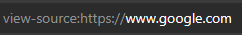

Vamos a aprender a revisar manualmente una aplicación web para poder detectar problemas de seguridad haciendo solo de las herramientas integradas del buscador.

Ya que los scripts y herramientas de seguridad pasarán por alto muchas vulnerabilidades.

Encontramos herramientas como:

- Ver el *código fuente* de la página web.
- *Inspector*: inspeccionar los elementos de una página web y realizar cambios en contenido generalmente bloqueado.
- *Depurador*: inspecciona y controla el flujo JavaScript de una página web.
- *Red*: ver todas las solicitudes de red que realiza una página web.

Ver el código fuente de una página web puede ayudarnos a descubrir más información sobre la aplicación web.

El código devuelto se compone de HTML, CSS y JavaScript.

Para acceder al código fuente de la página web —> *view-source:URL_pagina_web*.

### Ejemplo con la página web de Google

  

Pequeño extracto del código fuente de la web de [Google](https://Google.com):

  

En el código fuente de la página web podemos encontrar comentarios realizados por el desarrollador del sitio web, estos comentarios vienen dados por `<! -- comentario -->`

También podemos encontrar enlaces a diferentes páginas HTML `<a href="/pagina_web"` , también podemos encontrar enlaces ocultos en una página web `serc` donde se puede encontrar alguna área privada utilizada por la empresa/organización para almacenar información sobre clientes, personal o de la propia empresa.

Los archivos CSS, JavaScript e imágenes pueden ser incluidos mediante código HTML, estos archivos se pueden almacenar en el mismo directorio y si este directorio aparece en el navegador encontramos un error de configuración.

Hoy en día las páginas webs están realizadas a través de un marco(código prefabricado), este marco si no está actualizado y contiene vulnerabilidades públicas para esa versión y el sitio web estaría en peligro.

La versión del marco utilizado se encuentra en un comentario al final del código fuente.

## Herramientas para desarrolladores

Cada navegador incluye herramientas para desarrolladores para depurar aplicaciones web.

Como pentester podemos aprovechar estas herramientas para proporcionarnos una compresión mucho más profunda y mejor sobre el sitio web.

Nos centraremos en las características: *Inspector*, *Debugger* y *Red*.

### Herramientas para desarrolladores - Inspección

*Element inspector* nos ayuda mostrándonos una representación en directo del contenido del sitio web, pudiendo editar e interactuar con los elementos de la página web.

Con esto podemos acceder a lugares que previamente estaban bloqueados modificando así el valor que no nos permitía acceder.

### Herramientas para desarrolladores - Depuración

La depuración está destinada a código JavaScript y nos es muy útil a la hora de averiguar si algo no está funcionando correctamente.

Como pentester nos da la oportunidad de poder profundizar en el código JavaScript de la página web.

Cuando estamos en la sección de depurador ‘*Debugger’* , en la parte de la izquierda encontramos todos los recursos que utiliza la página web actual.

El código JavaScript se ve en una única línea ya que se ha ofuscado( ilegible ) para que sea complicado de leer.

Usando la opción *Pretty Print* ‘{ }’ del debugger podemos mostrar el código JS de manera más legible.

Podemos hacer uso de *Breakpoints* para forzar al navegador que se pare antes de ejecutar una parte del código JS. Si hacemos click en el numero de la línea del código, se pondrá automáticamente un breakpoint.

### Herramientas para desarrolladores - Red

Desde la pestaña de red ‘N*etwork’* podemos hacer un seguimiento de las peticiones / solicitudes que realiza la página web. Si hacemos click en la pestaña de Red y seguidamente actualizamos la página web, veremos todos los archivos que solicita la misma.

AJAX es un método para enviar y recibir datos de red en un fondo de aplicación web sin interferir cambiando la página web actual
---