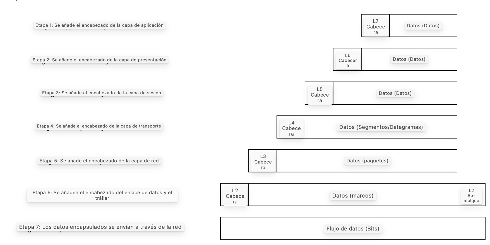
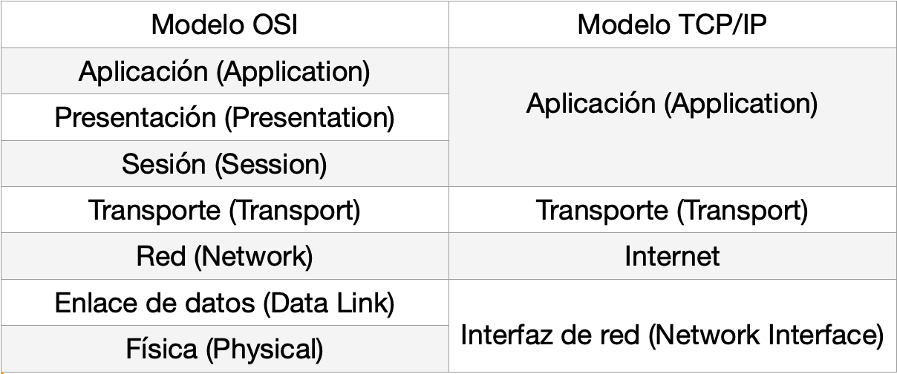

---
title: Introducción a Networking
layout: project
post-image: "../assets/images/Labs/IntroNetw/nw.png"
description: En este módulo veremos una introducción sobre la teoría de los modelos OSI y TCP / IP y fundamentos básicos de algunas herramientas básicas de networking.
enlace: https://tryhackme.com/r/room/introtonetworking
difficulty: Fácil
tags: 
  - LAB
--- 
# El modelo OSI

> El modelo OSI (Open Systems Interconnection) es un modelo estándar que usamos para demostrar la teoría detras del networking.

Consta de 7 capas, siendo la 7 más lógica y la 1 la más física:

## Capa 7 - Aplicación

Esta capa nos proporciona opciones de red a los programas que se ejecutan en un ordenador. Funciona exclusivamente con apliaciones, proporcionando así una interfaz para la transmisión de datos.
Los datos recibidos a la capa de aplicación, se pasan a la capa de presentación.

## Capa 6 - Presentación

Recibe datos de la capa de aplicación, estos datos pueden estar en un formato no estandarizado que pueda ser entendido por la capa de apliación del ordenador receptor.
La *capa de presentación* traduce los datos a un formato estandarizado , maneja cualquier cifrado, compresión…

## Capa 5 - Sesión

Recibe los datos con el formato correcto de la capa de presentación, luego comprueba si puede establecer conexión con otro ordenador a través de la red, si no puede, manda un error y termina el proceso de conexión.

SI la sesión se establece con éxito, el trabajo de la *capa de sesión* es mantener la conexión asi como sincronizar la comunicación entre ambos ordenadores.

Esto nos permite poder realizar múltiples peticiones a diferentes ‘*endpoints*’ sin que se mezclen los datos enviados (por ejemplo, varias pestañas de un navegador web abiertas a la vez).

Cuando la *capa de sesión* ha registrado la conexión con éxito entre host - ordenador remoto, estos datos se pasan a la _capa de transporte_.

## Capa 4 - Transporte

Esta capa tiene el propósito de elegir que protocolo va a ser usado para poder transmitir los datos.

Encontramos dos protocolos:

### Protocolo TCP

> *El protocolo TCP (Transmission Control Protocol) es un protocolo orientado a la conexión que requiere un ‘saludo de tres vías’.*
> 

El protocolo TCP ofrece una transferencia de datos fiable, garantiza que todos los paquetes de datos lleguen a su destino y si hay datos que se pierden, se vuelven a enviar.

Los protocolos: ***HTTP***, ***POP3***, ***IMAP*** y ***SMTP***  hacen uso de TCP.

### Protocolo UDP

> *El protocolo UDP (User Datagram Protocol) es un protocolo sin conexión, es decir, no requiere que se establezca una conexión. UDP es muy adecuado para protocolos que dependan de consultas muy rápidas (como DNS) y para protocolos que dan prioridad a la comunicaciones en tiempo real como ver videos, difusión..*
> 

El protocolo UDP, a diferencia del _protocolo TCP_ no garantiza una transferencia de datos fiables, UDP manda paquetes a la máquina receptora los cuales pueden llegar o no con éxito (por ejemplo, en una videollamada cuando se pixela la imagen).

Los paquetes de bits transportados en el protocolo TCP son llamados **segmentos**  y en UDP **datagramas.**

## Capa 3 - Red

La *capa de red* es la responsable de localizar el destino de nuestra petición, cogiendo la dirección IP del destino, calculando así la mejor ruta para llegar a él.
Hace uso del direccionamiento lógico **direcciones IPs**, que es controlado por software. Estas direcciones lógicas se utilizan para dar órdenes a las redes, permitiendo así clasificarlas adecuadamente.

La más común es la IPV4.

## Capa 2 - Enlace de datos

Esta capa se centra en la direccionamiento físico de la transmisión.

La *capa de enlace de datos* recibe un paquete de la capa de red que contiene la dirección IP (del ordenador remoto) + la dirección física **MAC**.

También comprueba la información recibida con el fin de comprobar si los datos han sido corrompidos durante la transmisión.

## Capa 1 - Física

La *capa física* es el propio hardware del ordenador.

Aquí es donde se envían/reciben pulsos eléctricos que componen la transferencia de datos a través de la red.

El trabajo de esta capa es convertir los datos binarios en señales y transmitirlas a la red y viceversa.

# Encapsulación

> *Es el proceso en el que los datos se transmiten desde el nivel superior al inferior del modelo OSI.*

   

A medida que los datos se transmiten a cada capa del modelo, se añade más información que contiene detalles específicos de cada capa.

Por ejemplo, en la **capa de red** se añade información sobre las IPs de origen y destino.

En la capa de **enlace de datos**, además de añadir la cabecera de la capa, se añade un trailer que añade seguridad a la hora de acceder a esos datos, ya que no se puede acceder a ellos si dicho trailer no se rompe.

En la **capa de transporte**, dependiendo del protocolo usado (TCP ó UDP) se llamarán segmentos o datagramas respectivamente.

El ordenador que envía datos → **encapsulación de los datos**, el ordenador que recibe datos → **desencapsulación de los datos.**

# Modelo TCP / IP

> *El modelo TCP / IP es muy parecido al [modelo OSI](Introduccio%CC%81n%20a%20Networking%2052ac932ef5ea493588c4f7dbebbf3e48.md), donde se hacen uso de características muy útiles de ambos protocolos, del protocolo TCP (controlamos el flujo de datos entre los dos ‘endpoints’), del IP (controlamos como los paquetes se direccionan y son enviados).
Divide en 5 capas, agrupando algunas de las capas del modelo OSI en una sola del modelo TCP / IP.*

Agrupación de las capas del modelo TCP / IP respecto al modelo OSI.

  

Los procesos de encapsulación y desencapsulación funcionan de la misma manera con los dos modelos (TCP / IP y OSI).

Como hemos mencionado anteriormente en el apartado del **Protocolo TCP**, éste requiere de un proceso llamado *saludo de tres vías* (three-Way Handshake).

Cuando se intenta realizar una conexión, el ordenador ‘cliente’ envía una petición al servidor remoto, esta petición contiene un ‘*bit SYN*’, esencial para empezar la conexión entre ambos.

Luego, el servidor responderá enviando al cliente un paquete el cual contiene ese bit SYN y otro bit llamado ‘*ACK*’.

Finalmente, el cliente, de nuevo envía otro paquete al servidor pero esta vez solamente con el ‘*bit ACK*’ confirmando así la conexión, 
dando por finalizado el *saludo de tres vías* y por ende, asegurando que los paquetes de datos serán enviados con éxito (sin perderse ninguno).

  

# Herramientas básicas de Networking

> *Haremos uso de ciertas herramientas, software o comandos, los cuales nos ayudarán a la hora de analizar cuantifica o calificativamente las redes.*
> 

## Ping

El comando *Ping* hace uso del protocolo ICMP  y calcula cuanto tiempo tardan los paquetes enviados en llega a su destino.

***Sintaxis* → `ping <url_pag_web_destino>`**

Ver ejemplo del comando ping → *_Protocolo ICMP_*

## Traceroute

El comando *Traceroute* es muy parecido al comando ping, pero este nos permite mapear el camino que hace la petición desde nuestra máquina hasta el destino.

Trabaja en la **capa ‘*internet*’ del modelo TCP/IP** y hace uso del protocolo ICMP (al igual que ping).

***Sintaxis** → `traceroute <url_pag_web_destino>`** (Linux) y  `tracert <url_pag_web_destino>` (Windows).

  

Vemos que tomó 8 saltos desde el router hasta el servidor de Google en 142.250.185.14

## WHOIS

Mediante el comando *WHOIS* podemos consultar el nombre a quién está registrado un *dominio*.

***Sintaxis*** → `whois <dominio>`

  

Sin embargo, esta herramienta solo nos proporciona una pequeña cantidad 
de información sobre el dominio: nombre del dominio, empresa que lo registró, 
ultima vez que se actualizó, etc. 

## Dig

Mediante el comando *Dig* podemos consultar manualmente los servidores DNS recursivos para poder obtener así información sobre dominios, es muy útil para la resolución de problemas de red.

Un **servidor DNS** *recursivo* es una solicitud que realiza nuestra computadora cuando quiere acceder a una dirección IP del sitio web que no ha podido ser verificada en su memoria caché local.

Los *Top-Level Domain servers (TLD)* se encuentran divididos en extensiones, por ejemplo, si buscamos ’google.com’, esta petición nos redireccionará a un servidor TLD que maneja los dominios que terminan en ‘ *.com* ‘, y este servidor le transmite la petición a un servidor de nombres autorizado apropiado.

Los *servidores de nombres autorizado* se utilizan para almacenar registros DNS para dominios, esto permite a las computadoras poder conectarse a la dirección IP del dominio que solicitó.

***Sintaxis*** → `dig <dominio> @<ip-servidor-DNS>`

  

A la hora de realizar la petición al dominio ‘google.com’ junto con la dirección IP del servidor ‘8.8.8.8’ vemos que hemos obtenido información sobre que la conexión se ha realizado con éxito sin errores.

Nos interesa la sección ‘ ***Answer*** ’ , donde encontramos el nombre del dominio, seguido del TTL (*Time To Live*) del registro DNS que hemos consultado. 

El ***TTL*** del registro informa a nuestra computadora el tiempo ‘*segundos*’ en el que tarda de ser válido el registro consultado.

  

En este caso el TTL es de 115 segundos.

También encontramos el tiempo que ha tardado en realizarse la consulta (en este caso 20 milisegundos).

---